# NRT - Generative Adversarial Networks
> This test suite validates the implementation of every Generative Adversarial Networks architecture available in the project. Its objective is not to benchmark performance or achieve state-of-the-art results, but rather to ensure that every model trains correctly, produces coherent outputs, and can be safely saved and reloaded.
>
> The experiments are intentionally not designed as strict benchmarks or attempts to reach state-of-the-art performance. Lightweight architectures and controlled training schedules are used to keep execution times reasonable. Nevertheless, several experiments use longer training schedules than the other NRT suites in order to provide qualitative insight into the behavior of different GAN formulations and hyperparameter choices.
> 
> Unlike diffusion models, whose training experiments are mainly intended to verify the implementation with very short CPU runs, some GAN experiments are trained for longer periods. This makes it possible to observe phenomena that are characteristic of adversarial training, such as oscillating losses, discriminator dominance, mode collapse, and progressive generator improvement.

# Directory Structure
```text
NRT_GANs/
├── outputs/
│   ├── blobs/
│   │   ├── blobs_real.png
│   │   └── ...
│   │   
│   ├── mnist/
│   │   ├── mnist_real.png                    
│   │   ├── ...
│   │   └── model_name/
│   │       ├── loss_history.png     # Loss history of Generator and Discriminator
│   │       └── mnist_gen_repY.png   # Sampling number Y to see progress
│   │   
│   └── cifar10/
│       └── ...
│
└── test.py
```
The generated outputs are mainly used to inspect the evolution of the adversarial training process.
For longer experiments, several intermediate samples are saved during training:
- `loss_history.png` tracks the evolution of the Generator and Discriminator losses
- `*_gen_repY.png` contains samples generated at different points during training
- `*_real.png` shows examples from the corresponding real dataset

These visualizations are particularly useful for identifying qualitative behaviors that cannot be inferred from the loss values alone.

# What is validated?
Each test verifies the complete GAN workflow, including:
- Model initialization
- Generator and Discriminator forward passes / loss computation
- Training loop execution
- Saving and loading checkpoints
- Configuration serialization
- Output tensor dimensions
- Sample generation

The purpose is to detect implementation regressions to verify every GAN architecture is functional and can be trained, rather than purely optimize reconstruction quality. 
The suite therefore validates both the common GAN interface and the architecture-specific training mechanisms.

However, some tests on the same architectures but with different hyperparameters are also performed to see if some architectures can bring better results than others for the same problem and dataset, even if the training is not pushed too much. Yet, compared to diffusion models trained for 5min and 2 epochs, here training times are pushed up to 50min and 50 epochs giving some results that can be compared between architectures and hyperparameters.


# Why GAN training is different
There is no single loss that simply decreases toward an optimum. The Generator and Discriminator continuously adapt to each other.
Consequently:
- Generator loss can increase while generated samples improve
- Discriminator loss can oscillate
- temporary discriminator dominance is common
- mode collapse can occur
- training stability depends strongly on architecture and hyperparameters

For this reason, the NRT experiments inspect both loss curves and generated samples.


# MLP Generator and Discriminator
```py
test_mlp_gen_disc()
```

### Architecture
The basic MLP components are tested independently before being used inside a complete GAN training loop.

The Generator progressively expands the latent vector:
```text
latent vector --> Linear --> Linear -->generated sample
```
The Discriminator performs the opposite mapping:
```text
input sample --> Linear --> Linear --> real / fake score
```

### Observations
This test primarily validates that the two networks can be initialized independently and that their forward passes produce tensors with the expected dimensions.


# DCGAN Generator and Discriminator
```py
test_dcgan_gen_disc()
```

### Architecture
DCGAN replaces the fully connected image generator/discriminator with convolutional architectures.
The main difference from the MLP GAN is that spatial structure is preserved throughout the network.

The Generator progressively increases spatial resolution:
```text
latent vector --> feature map --> upsampling --> larger feature map --> generated image
```
The Discriminator performs the reverse process:
```
input image --> convolution --> feature extraction --> spatial reduction --> real / fake score
```

### Observations
The test validates the convolutional Generator and Discriminator independently and checks that the image dimensions remain consistent throughout the forward passes.


# Conditional Generator and Discriminator
```py
test_cgan_gen_disc()
```

### Architecture
A Conditional GAN extends the standard GAN by providing additional information to both networks.
Instead of generating only from $G(z)$, the Generator receives both the latent vector and a condition: $G(z,y)$ where $y$ can represent a class label.
In this implementation, class labels are transformed into learned embeddings and combined with the latent representation.
```text
             latent vector z
                    │
                    ▼
               embedding
                    │
                    ├──────┐
                    │      │
             class label y │
                    │      │
                    ▼      │
               embedding   │
                    │      │
                    └──┬───┘
                       ▼
                    Generator
                       │
                       ▼
                  fake sample
```
The Discriminator also receives the class information, allowing it to determine whether a sample is both:
realistic, consistent with the requested class.

### Observations
The test validates the additional conditioning pathway and ensures that class information can be incorporated into both the Generator and Discriminator.


# MLP GAN on the Blobs Dataset
```py
test_mlp_gan_blobs()
```

This experiment moves beyond isolated forward-pass tests and validates the complete adversarial training loop.
The synthetic blobs dataset is intentionally simple:
```text
              ● ●
           ● ●

     ● ●                 ● ●

              ● ●
```
It is useful because the target distribution contains a small number of clearly separated modes. This makes it possible to visually inspect whether the Generator learns the structure of the distribution.

### Architecture
The experiment uses 500 epochs with intermediate samples saved during training.
It use the `LeastSquare` loss function, which is known to improve training stability compared to the original GAN loss (it penalizes samples that are far from the decision boundary more strongly). 
For the MLP architecture, the Generator and Discriminator are both composed of two hidden layers with 128 units each. 
The latent dimension is set to 16, and the input dimension matches the 2D blobs dataset. 
Training parameters have been selected to provide a balance between speed and convergence, with a learning rate of 2e-4 and a step size of 50 epochs for learning rate decay. Spectral normalization is applied to the Discriminator to further enhance stability.

### Observations
The Generator initially produces samples distributed relatively broadly over the space. 
As training progresses, the generated samples become increasingly concentrated around the target modes.

The Generator and Discriminator losses oscillate (after a first period of decrease for both), which is expected in an adversarial optimization problem: neither network is optimizing against a fixed target.

After longer training, the Generator successfully reproduces the main geometry of the eight Gaussian clusters.

<table>
  <tr>
    <td style="text-align:center;">
      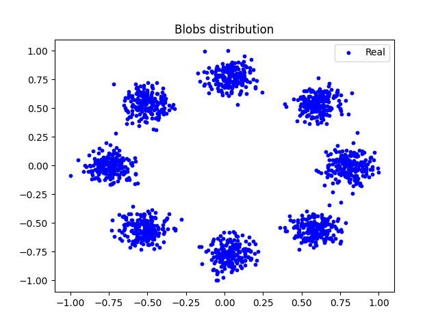
      <br><b>Real samples from the synthetic blobs dataset</b>
    </td>
    <td style="text-align:center;">
      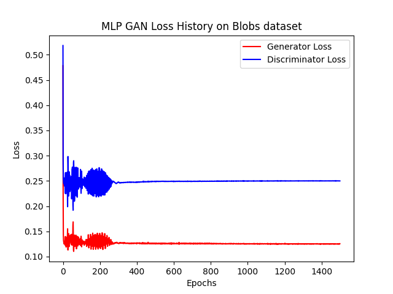
      <br><b>Loss history of Generator and Discriminator over epochs</b>
    </td>
  </tr>
</table>

Intermediate samples illustrate the evolution of the adversarial game:

<table>
  <tr>
    <td style="text-align:center;">
      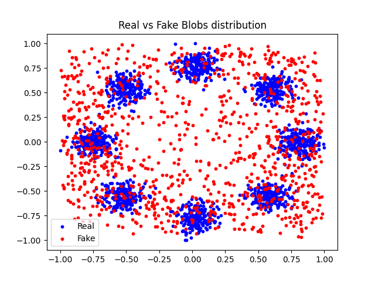
      <br><b>Sampling number 1 to see progress in the adversarial game evolution and fooling</b>
    </td>
    <td style="text-align:center;">
      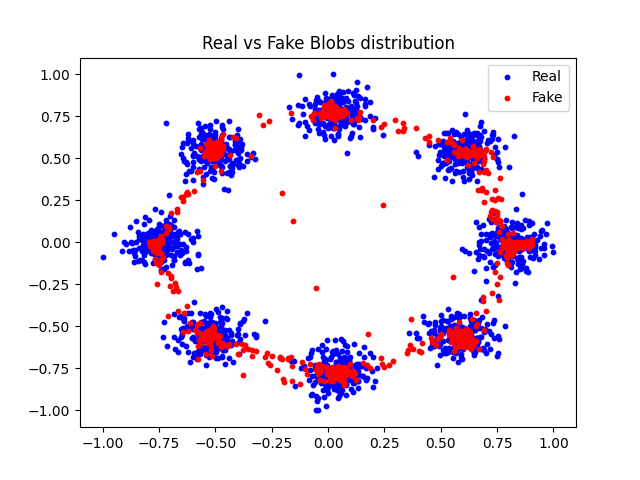
      <br><b>Sampling number 5 to see progress in the adversarial game evolution and fooling</b>
    </td>
  </tr>
</table>

The experiment demonstrates that even a relatively small MLP can learn a low-dimensional multimodal distribution when the adversarial training dynamics are sufficiently stable.


# MLP Wasserstein GAN on Blobs
```py
test_mlp_wasserstein_gan_blobs()
```

### Architecture
This experiment replaces the standard GAN objective with a Wasserstein objective and uses a gradient penalty.
WGAN replaces the conventional discriminator with a critic that estimates a Wasserstein-style distance between the real and generated distributions.

The critic is required to satisfy a Lipschitz constraint. 
In WGAN-GP, this constraint is encouraged through a gradient penalty rather than simple weight clipping.

The gradient penalty has the form:
$\lambda \mathbb{E}{\hat{x}} \left(|\nabla{\hat{x}}D(\hat{x})|_2 - 1 \right)^2$.
This adds an additional regularization term to the critic objective.

### Observations
On the simple two-dimensional blobs dataset, the WGAN-GP configuration does not perform as well as the simpler LSGAN configuration.

The losses remain strongly oscillatory, while the generated samples tend to accumulate around the edges of the target distribution rather than reproducing the individual clusters.

<table>
  <tr>
    <td style="text-align:center;">
      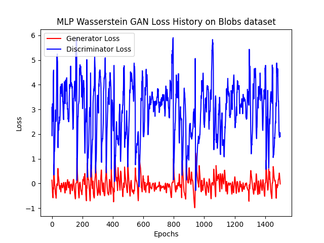
      <br><b>Loss history of Generator and Discriminator over epochs</b>
    </td>
    <td style="text-align:center;">
      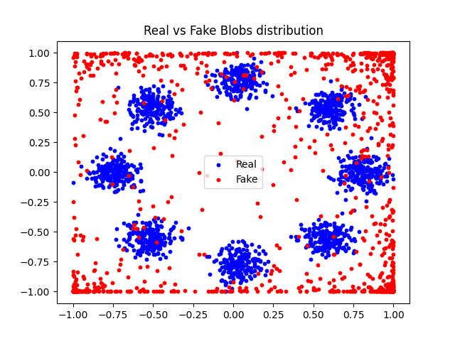
      <br><b>Sampling number 5 to see progress in the adversarial game evolution and fooling</b>
    </td>
  </tr>
</table>

This experiment should not be interpreted as evidence that WGAN-GP is intrinsically worse than LSGAN. Rather, it illustrates that an architecture and objective that are useful for difficult high-dimensional distributions are not necessarily the best choice for a very simple synthetic distribution.

The blobs experiment is deliberately low-dimensional and easy to separate. The additional Lipschitz regularization introduced by the gradient penalty may therefore impose constraints that are unnecessary for this particular task.

> **Takeaway**: GAN variants should be evaluated in relation to the complexity of the target distribution. A more sophisticated objective does not automatically produce better results on a simpler problem


# Unrolled GAN on Blobs
```py
test_unrolled_gan_blobs()
```

### Architecture
Standard GAN training updates the Generator using the current state of the Discriminator.
Unrolled GANs instead approximate the effect of several future Discriminator updates when computing the Generator gradient.
```text
Current Generator
       │
       ▼
Current Discriminator
       │
       ▼
Simulate several D updates
       │
       ▼
Estimate future discriminator state
       │
       ▼
Update Generator
```
The motivation is to make the Generator optimization aware of how the Discriminator is likely to react to its current update.

One of the intended benefits is improved resistance to **mode collapse**.

### Observations
On the blobs dataset, the experiment does not show an improvement over the simpler GAN configuration.

At some point during training, the Generator collapses toward a limited subset of the distribution. The losses also stop showing progression, and successive generated samples show little improvement.

<table>
  <tr>
    <td style="text-align:center;">
      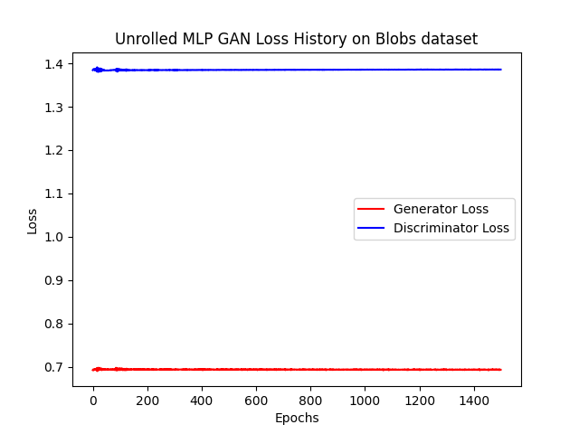
      <br><b>Loss history of Generator and Discriminator over epochs</b>
    </td>
    <td style="text-align:center;">
      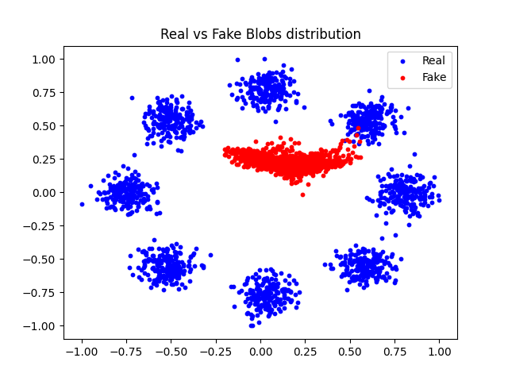
      <br><b>Sampling number 5 to see progress in the adversarial game evolution and fooling</b>
    </td>
  </tr>
</table>

Again, the result is strongly dependent on the dataset and hyperparameters. The additional unrolling mechanism increases computational cost and optimization complexity, while the blobs dataset is already simple enough to be learned by a conventional MLP GAN.

> **Takeaway**: unrolling is primarily interesting when discriminator dynamics contribute to instability or mode collapse. On a simple low-dimensional distribution, its additional complexity does not necessarily provide a benefit.


# MLP GAN on MNIST
```py
test_mlp_gan_mnist()
```

### From Blobs to MNIST
The previous experiments highlight an important limitation of the blobs dataset.
Blobs are primarily a low-dimensional geometry problem: $x \in \mathbb{R}^2$
MNIST, in contrast, is a high-dimensional image distribution: $x \in \mathbb{R}^{28\times28}$.

The Generator must therefore learn much more than the locations of several clusters. It must learn:
- local pixel correlations
- stroke structure
- digit topology
- global spatial organization
- variation between different examples of the same digit

This makes MNIST a more meaningful test of whether an adversarial architecture can learn a structured data manifold.

### Architecture
The images are flattened from $28\times28 = 784$ pixels into a vector before being processed by the MLP.
Spatial information is therefore lost.
The model is here slightly larger than the previous blobs experiments, with two hidden layers of 256 units each. The latent dimension is increased to 64 to provide more capacity for the higher-dimensional data.

The training consists of 50 epochs with 5 samplings saved during training to illustrate the evolution of the adversarial game. 

### Observations
The early training phase is initially dominated by the Discriminator. During the first few epochs, the Discriminator loss decreases slowly while the Generator struggles to produce convincing samples.

After several epochs, the Generator begins to catch up and its loss decreases. Around epoch 10, the generated samples already start becoming visually closer to the real MNIST distribution.

The Generator loss subsequently decreases while the Discriminator loss increases, reflecting the fact that the Generator is becoming increasingly capable of fooling the Discriminator.

<table>
  <tr>
    <td style="text-align:center;">
      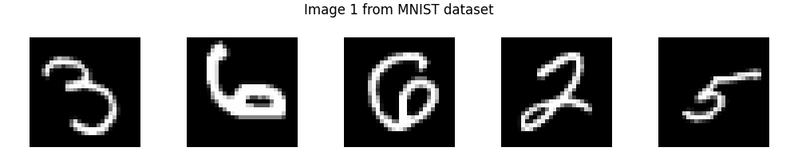
      <br><b>Real samples from the MNIST dataset</b>
    </td>
    <td style="text-align:center;">
      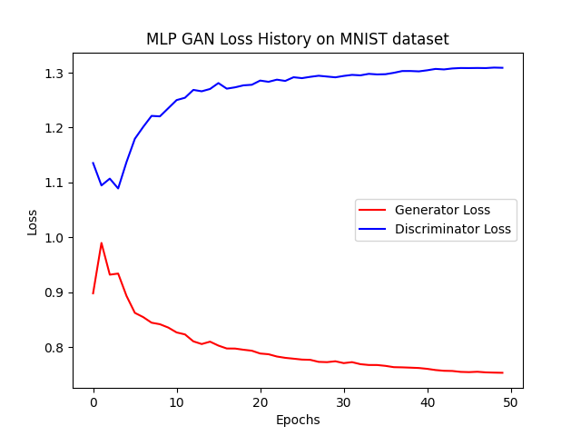
      <br><b>Loss history of Generator and Discriminator over epochs</b>
    </td>
  </tr>
</table>

The evolution of the generated samples shows a clear progression:
- Early training: generated images contain little recognizable structure
- Intermediate training: digit-like shapes begin to appear and diversity increases
- Later training: the Generator produces recognizable digits with reasonable global structure
- Final samples: digits are generally convincing, although they remain somewhat blurry and the background is slightly gray rather than uniformly black

<table>
  <tr>
    <td style="text-align:center;">
      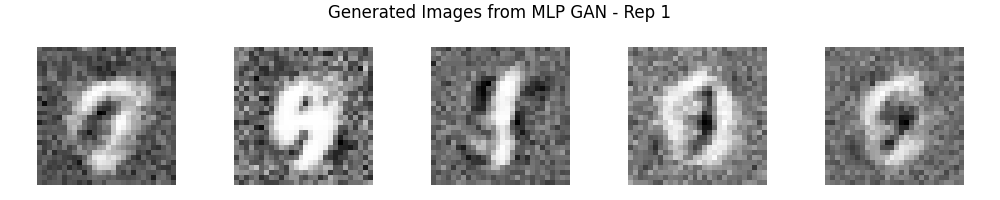
      <br><b>Sampling number 1 to see progress in the adversarial game evolution and fooling</b>
    </td>
    <td style="text-align:center;">
      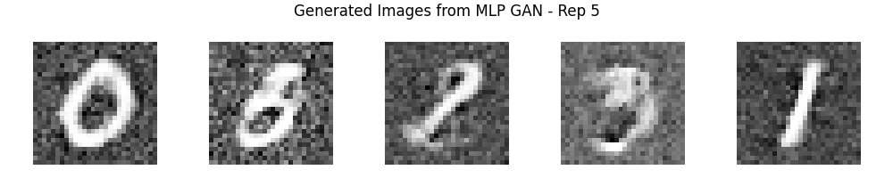
      <br><b>Sampling number 5 to see progress in the adversarial game evolution and fooling</b>
    </td>
  </tr>
</table>

The experiment demonstrates that an MLP GAN can learn the broad structure of MNIST, but the lack of explicit spatial inductive bias limits the quality of the generated images.

In particular, treating the image as a 784-dimensional vector discards the natural two-dimensional spatial structure of the input. This motivates the use of convolutional architectures such as DCGAN for image generation.


# Wasserstein GAN on MNIST
```py
test_mlp_wasserstein_gan_mnist()
```
### Architecture
The same MLP architecture is used but with Wasserstein loss and gradient penalty.

### Observations
The loss evolution is markedly different from the standard GAN experiment. The curves remain relatively stable for a period before showing a peak and then settling again.

The generated samples do not show a comparable learning progression. They mainly contain bright regions around the centre without clearly defined digit structures.

Under this particular configuration and training budget, the WGAN experiment therefore does not demonstrate the same qualitative progress observed with the standard MLP GAN.

<table>
  <tr>
    <td style="text-align:center;">
      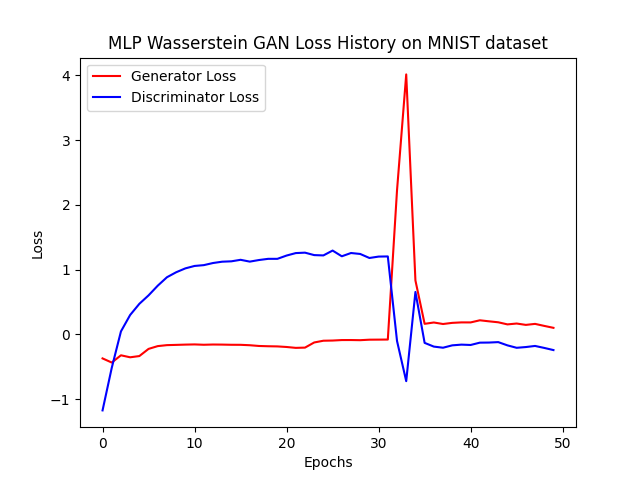
      <br><b>Loss history of Generator and Discriminator over epochs</b>
    </td>
    <td style="text-align:center;">
      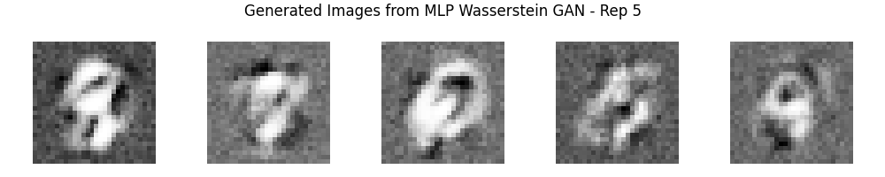
      <br><b>Sampling number 5 to see progress in the adversarial game evolution and fooling</b>
    </td>
  </tr>
</table>


# Unrolled GAN on MNIST
```py
test_unrolled_gan_mnist()
```

### Architecture
The same MLP configuration is extended with the unrolled GAN training procedure.

### Observations
The loss behaviour is similar to the standard MLP MNIST experiment, but the generated samples are of lower quality.

The additional unrolled discriminator updates therefore do not provide an observable benefit within this particular NRT configuration.

Again, this should be interpreted as an observation about the selected architecture, hyperparameters, and limited training budget rather than a general conclusion about Unrolled GANs.

<table>
  <tr>
    <td style="text-align:center;">
      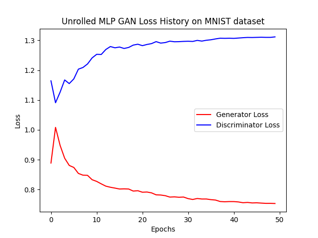
      <br><b>Loss history of Generator and Discriminator over epochs</b>
    </td>
    <td style="text-align:center;">
      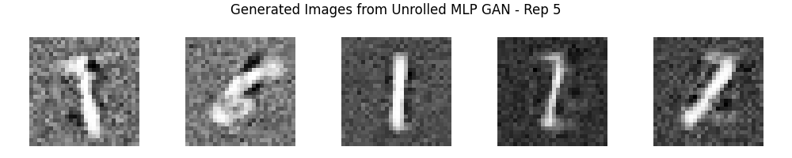
      <br><b>Sampling number 5 to see progress in the adversarial game evolution and fooling</b>
    </td>
  </tr>
</table>


# Conditional GAN on MNIST
```py
test_cgan_gan_mnist()
```

### Architecture
The MLP GAN is extended with class conditioning. Class labels are passed to both the Generator and Discriminator.

The conditioning mechanism adds a class embedding to the existing MLP-based architecture.

### Observations
This is one of the strongest MNIST results in the current NRT experiments.

The Generator loss progressively decreases while the Discriminator loss increases, the generator is able to fool the discriminator more and more, the discriminator is not able to catch up with the generator. The generated samples also become increasingly convincing during training.

Most importantly, the Generator follows the requested class labels: the generated digits correspond to the conditioning information provided as input.

Among the MNIST GAN experiments tested so far, this configuration produces the cleanest and most controlled samples.

<table>
  <tr>
    <td style="text-align:center;">
      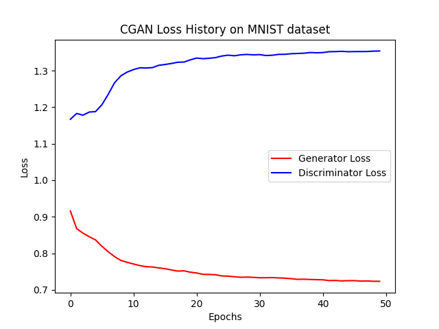
      <br><b>Loss history of Generator and Discriminator over epochs</b>
    </td>
    <td style="text-align:center;">
      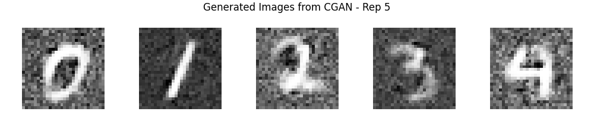
      <br><b>Sampling number 5 to see progress in the adversarial game evolution and fooling</b>
    </td>
  </tr>
</table>

This highlights the usefulness of conditioning when the dataset contains explicit semantic classes: instead of learning the complete MNIST distribution without guidance, the Generator receives additional information about which digit it should generate.


# Deep Convolutional GAN on MNIST
```py
test_dcgan_mnist()
```

### Architecture
Unlike the MLP models, the DCGAN keeps the image spatial structure throughout the network, there is no `flattening=True` as part of the dataset loading procedure.
The MNIST images are downsampled to 16 × 16.

Discriminator:
```text
Conv(1 → 128) --> Conv(128 → 64) --> Conv(64 → 32) --> latent representation
```
Generator: approximately the reverse convolutional structure

### Observations
The loss curves remain relatively stable, with only small linear variations in both Generator and Discriminator losses (gen increase a bit while disc decrease a bit, but it remain pretty much flat).

Despite this, the generated samples are surprisingly convincing for such a lightweight configuration:
- Digits are recognizable
- Shapes are cleaner than those produced by the MLP GAN
- The background is closer to the expected black background
- Spatial structure is better preserved

<table>
  <tr>
    <td style="text-align:center;">
      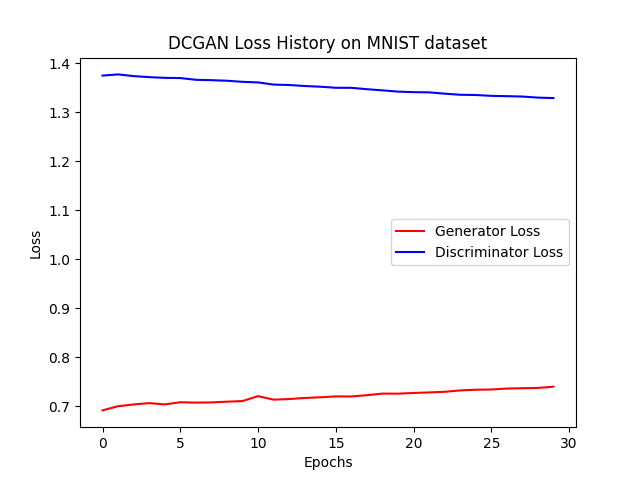
      <br><b>Loss history of Generator and Discriminator over epochs</b>
    </td>
    <td style="text-align:center;">
      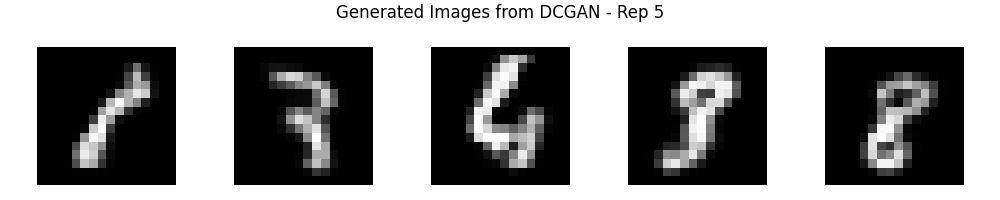
      <br><b>Sampling number 5 to see progress in the adversarial game evolution and fooling</b>
    </td>
  </tr>
</table>

This provides a clear qualitative demonstration of the advantage of convolutional processing for image generation.
Even though the model is not substantially larger than the MLP baseline, preserving spatial information produces noticeably cleaner MNIST samples (still took way more time to train than the MLP GAN, but the results are better).


# Deep Convolutional Wasserstein GAN on MNIST
```py
test_dcgan_wasserstein_mnist()
```

### Architecture
The DCGAN architecture is retained while replacing the standard adversarial objective with Wasserstein loss and gradient penalty.

### Observations

The loss curves show very little movement during training.
The generated samples are mostly black, with only small bright or grey regions, and no clear digit structures emerge.

<table>
  <tr>
    <td style="text-align:center;">
      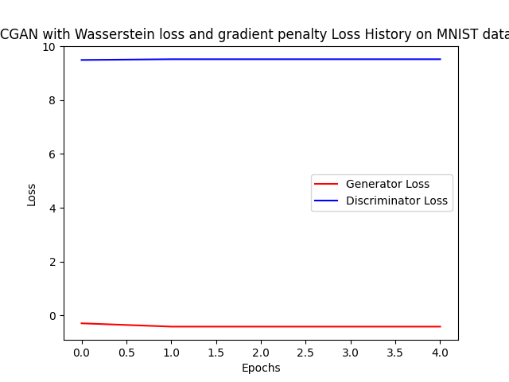
      <br><b>Loss history of Generator and Discriminator over epochs</b>
    </td>
    <td style="text-align:center;">
      
      <br><b>Sampling number 5 to see progress in the adversarial game evolution and fooling</b>
    </td>
  </tr>
</table>

Within the current NRT setup, this configuration therefore does not demonstrate useful learning.


# Conditional GAN on CIFAR-10
```py
test_cgan_cifar10()
```

### from MNIST to CIFAR-10
The CIFAR-10 dataset is a more challenging image generation task than MNIST. It contains
- 10 classes of natural images (airplanes, cars, birds, cats, deer, dogs, frogs, horses, ships, trucks)
- `32 × 32` RGB images

### Architecture
The conditional MLP architecture used on MNIST is extended to CIFAR-10.
Because the model is fully connected, the images are flattened before being passed to the network.
The experiment uses:
- `16 × 16` RGB images
- Conditional labels
- 25 training epochs

### Observations
Despite the loss of explicit spatial structure caused by flattening, the Generator is surprisingly able to learn some visual structure.
The generated images show:
- Different colour combinations
- Different coarse shapes
- Some diversity between samples
- Recognizable image-like structure

However, the images remain noisy and contain visible artifacts. The `16 × 16` resolution also limits the amount of detail that can be represented.

The loss curves show a clear adversarial progression, with the Generator progressively becoming better at fooling the Discriminator with the generator loss decreasing and the discriminator loss increasing. The curves cross around epoch 3, indicating that the Generator is starting to outperform the Discriminator.

<table>
  <tr>
    <td style="text-align:center;">
      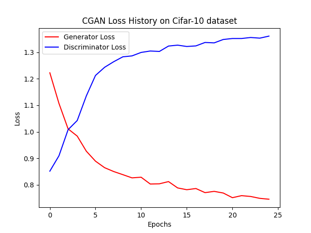
      <br><b>Loss history of Generator and Discriminator over epochs</b>
    </td>
    <td style="text-align:center;">
      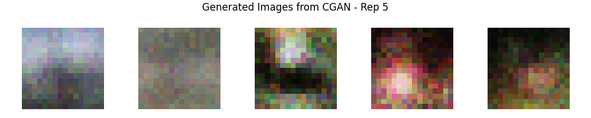
      <br><b>Sampling number 5 to see progress in the adversarial game evolution and fooling</b>
    </td>
  </tr>
</table>

This experiment is particularly interesting because it shows that an MLP can still learn coarse visual distributions from flattened images, although a convolutional architecture is expected to be more appropriate for preserving local spatial relationships.


# Deep Convolutional GAN on CIFAR-10
```py
test_dcgan_cifar10()
```

### Architecture
The DCGAN preserves the RGB spatial structure of CIFAR-10 images.
```text
image_channels = 3   # no dataset flattening, RGB images
image_size = 16      # downsampled from 32x32
latent_dim = 64
hidden_dims = [256, 128, 64]
```
Only a subset of 2,000 images is used, with 25 training epochs.

### Observations
The Generator loss increases while the Discriminator loss decreases, without a clear crossing during the experiment.

Nevertheless, the generated samples begin to show meaningful visual structure:
- Different colour distributions
- Distinct coarse shapes
- Some diversity between samples
- Cleaner outputs than the corresponding flattened MLP experiment

The results remain far from realistic CIFAR-10 images (also due to the low resolution and small dataset size), but the experiment demonstrates that the convolutional architecture is able to extract and reproduce more spatial information.

<table>
  <tr>
    <td style="text-align:center;">
      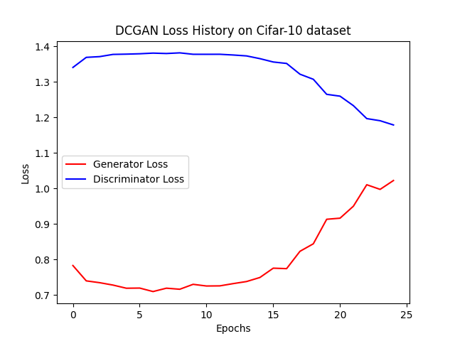
      <br><b>Loss history of Generator and Discriminator over epochs</b>
    </td>
    <td style="text-align:center;">
      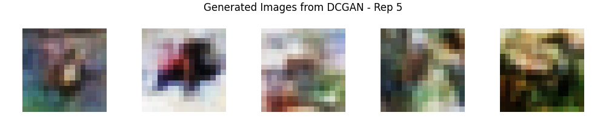
      <br><b>Sampling number 5 to see progress in the adversarial game evolution and fooling</b>
    </td>
  </tr>
</table>


# Deep Convolutional GAN on CIFAR-10 — Smaller Architecture and more epochs
```py
test_dcgan_cifar10_2()
```

### Architecture
This experiment investigates whether a smaller architecture trained for longer can compensate for reduced model capacity.
```text
hidden_dims = [128, 64]
latent_dim = 64
image_size = 16
epochs = 50
```

### Observations
The generated samples are visually similar to the previous DCGAN experiment, although they contain somewhat less detail and are slightly blurrier. 

Interestingly, the loss dynamics are different. After an initial period in which the Discriminator dominates, the Generator progressively catches up, with the curves crossing at approximately 10 epochs.

The comparison suggests that increasing the number of training epochs can compensate to some extent for a reduction in architecture size, although the resulting quality remains limited by the low image resolution and restricted dataset.

<table>
  <tr>
    <td style="text-align:center;">
      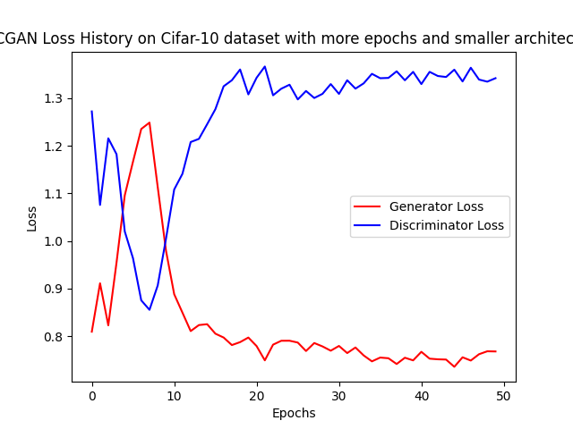
      <br><b>Loss history of Generator and Discriminator over epochs</b>
    </td>
    <td style="text-align:center;">
      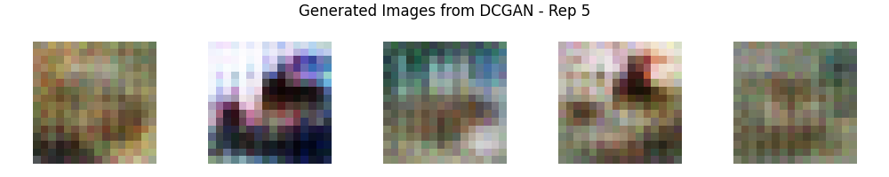
      <br><b>Sampling number 5 to see progress in the adversarial game evolution and fooling</b>
    </td>
  </tr>
</table>


# Deep Convolutional GAN on CIFAR-10 — Better resolution
```py
test_dcgan_cifar10_3()
```

### Architecture
The larger DCGAN configuration is trained for 50 epochs at the original `32 × 32` resolution.
```text
hidden_dims = [256, 128, 64]
latent_dim = 64
image_size = 32
```
The training subset contains only 2,000 images.

### Observations
The loss curves show an unusual initial phase followed by relatively stable behaviour, with neither network clearly dominating.

The generated samples show colour variation and some coarse structures, but diversity is lower than in the previous experiments. Samples also appear somewhat blurrier and more similar to one another.

The experiment highlights an important limitation of the current setup: increasing image resolution increases the representational requirements of the model, while using only a small subset of CIFAR-10 restricts the diversity of examples available during training.

<table>
  <tr>
    <td style="text-align:center;">
      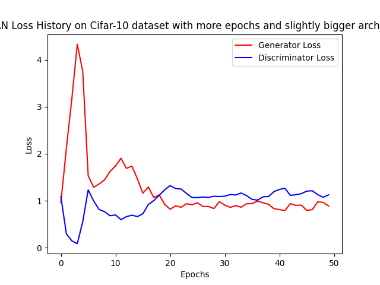
      <br><b>Loss history of Generator and Discriminator over epochs</b>
    </td>
    <td style="text-align:center;">
      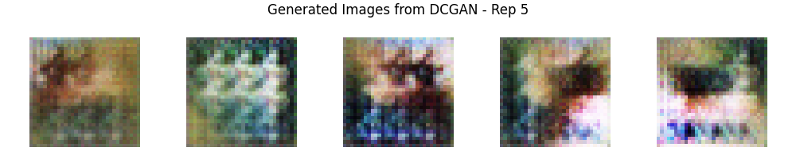
      <br><b>Sampling number 5 to see progress in the adversarial game evolution and fooling</b>
    </td>
  </tr>
</table>


# Deep Convolutional GAN on CIFAR-10 — Larger subset and smaller architecture
```py
test_dcgan_cifar10_4()
```

### Architecture
This experiment keeps the smaller network while increasing the training dataset.
```text
hidden_dims = [128, 64]
latent_dim = 64
image_size = 32
dataset subset = 10,000 images
epochs = 50
```
We're there in the range of the 50min of training time on a single CPU, and one of the most consuming one I had the patience to do.

### Observations
The first approximately 10 epochs show a clear adversarial progression: the Generator loss decreases while the Discriminator loss increases. The training then stabilizes and both losses oscillate around relatively stable values.

The generated samples are noticeably improved compared with the previous CIFAR-10 experiments:
- More diverse colours
- More distinct shapes
- Sharper structures
- Better use of the additional `32 × 32` spatial resolution
- Greater variation between generated samples

The generated images are still not recognizable as specific CIFAR-10 classes, but they demonstrate that the Generator is learning a meaningful distribution of colours and coarse visual structures.
<table>
  <tr>
    <td style="text-align:center;">
      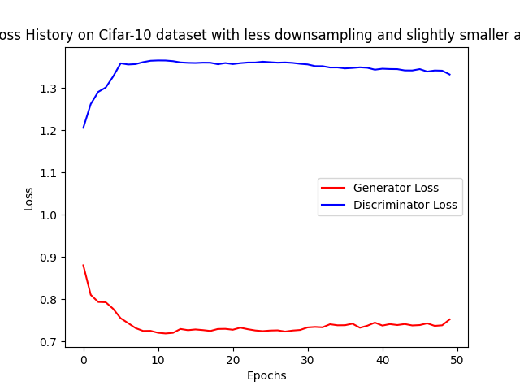
      <br><b>Loss history of Generator and Discriminator over epochs</b>
    </td>
    <td style="text-align:center;">
      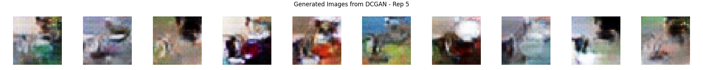
      <br><b>Sampling number 5 to see progress in the adversarial game evolution and fooling</b>
    </td>
  </tr>
</table>

This experiment also suggests that dataset size can be as important as model capacity. Increasing the training subset from 2,000 to 10,000 images provides substantially more variation for the Generator to learn


# StyleGAN on CIFAR-10
```py
test_stylegan_cifar10()
```

### Architecture
A lightweight StyleGAN configuration is tested on `16 × 16` CIFAR-10 images
```text
latent_dim = 32
hidden_dims = [128, 64]
style_dim = 32
image_channels = 3
image_size = 16

dataset subset = 2,000
epochs = 5
```

### Observations
With only five epochs and a small dataset, the model does not show meaningful adversarial learning.

The Generator loss increases while the Discriminator loss decreases, and the generated samples mostly consist of blurred colour patterns without recognizable structures.

<table>
  <tr>
    <td style="text-align:center;">
      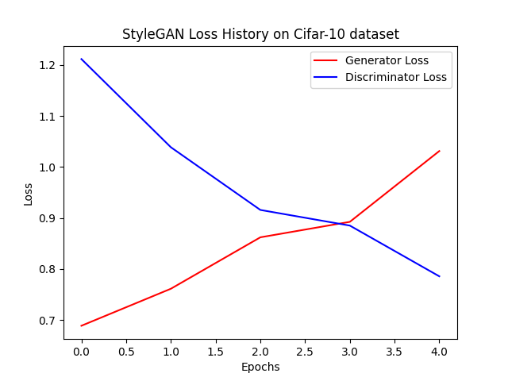
      <br><b>Loss history of Generator and Discriminator over epochs</b>
    </td>
    <td style="text-align:center;">
      
      <br><b>Sampling number 5 to see progress in the adversarial game evolution and fooling</b>
    </td>
  </tr>
<table>

The experiment nevertheless validates that the StyleGAN pipeline can be instantiated and trained under the NRT configuration.


# StyleGAN on CIFAR-10 — Larger architecture, more epochs and larger dataset
```py
test_stylegan_cifar10_2()
```

### Architecture
A substantially larger configuration is tested at `32 × 32` resolution
```text
loss = LeastSquare
latent_dim = 128
hidden_dims = [256, 128, 64]
style_dim = 128
image_channels = 3
image_size = 32

dataset subset = 10,000
epochs = 50
```

### Observations
Despite the larger architecture, longer training schedule (also almost 1h), and larger dataset, the generated samples remain dominated by blurred colour patterns.

The Generator loss increases while the Discriminator loss decreases, indicating that the Generator does not successfully catch up within this configuration, we want the opposite to happen, the generator should be able to fool the discriminator more and more, but it is not the case here. The generated samples remain blurry and lack recognizable structures.

<table>
  <tr>
    <td style="text-align:center;">
      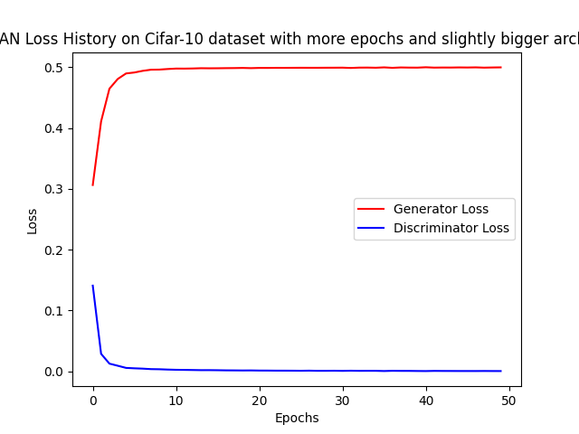
      <br><b>Loss history of Generator and Discriminator over epochs</b>
    </td>
    <td style="text-align:center;">
      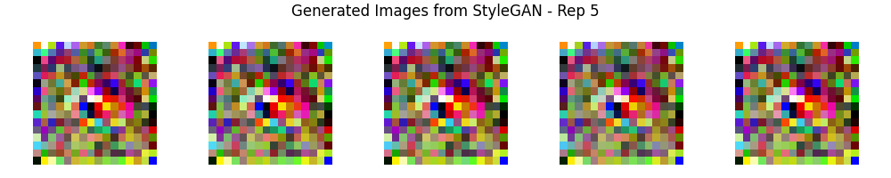
      <br><b>Sampling number 5 to see progress in the adversarial game evolution and fooling</b>
    </td>
  </tr>
</table>

The experiment is particularly useful as an NRT comparison because it shows that simply increasing model capacity and training time does not guarantee improved results. Style-based architectures introduce additional mechanisms that may require substantially different tuning from the simpler DCGAN configurations.


# StyleGAN on CIFAR-10 — Smaller Configuration
```py
test_stylegan_cifar10_3()
```
### Architecture
A much smaller StyleGAN configuration is tested under the same `32 × 32`, 10,000-image and 50-epoch setup.
```text
loss = LeastSquare
latent_dim = 32
hidden_dims = [32, 32, 16]
style_dim = 32
image_channels = 3
image_size = 32
```

### Observations
The results remain qualitatively similar to the larger StyleGAN experiment.
The generated samples are dominated by blurred colour structures and do not develop recognizable CIFAR-10 objects.

<table>
  <tr>
    <td style="text-align:center;">
      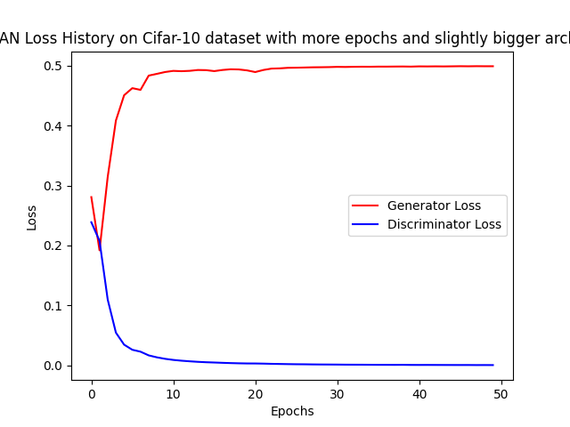
      <br><b>Loss history of Generator and Discriminator over epochs</b>
    </td>
    <td style="text-align:center;">
      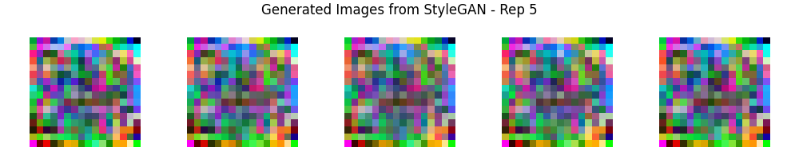
      <br><b>Sampling number 5 to see progress in the adversarial game evolution and fooling</b>
    </td>
  </tr>
</table>

This comparison suggests that, within the current NRT configuration, reducing the architecture does not resolve the main training difficulty observed with StyleGAN.


# Summary

### Summary of Model Tests
| Model | Dataset | Main observation |
|-------|--------|------------------|
| MLP GAN | Blobs | Learns the simple multi-modal distribution |
| WGAN-GP | Blobs | Unstable/unsuitable behaviour for this configuration |
| Unrolled GAN | Blobs | Mode collapse observed |
| MLP GAN | MNIST | Learns recognizable but somewhat blurry digits |
| WGAN-GP | MNIST | Little useful learning under the tested configuration |
| Unrolled GAN | MNIST | Lower sample quality than standard MLP GAN |
| Conditional GAN | MNIST | Cleanest MNIST results; conditioning is effective |
| DCGAN | MNIST | Cleaner spatial structure than MLP |
| DCGAN + WGAN-GP | MNIST | Little useful learning under the tested configuration |
| Conditional GAN | CIFAR-10 | Surprisingly effective despite flattened images |
| DCGAN | CIFAR-10 | Better spatial structure and colour diversity |
| DCGAN, smaller/longer | CIFAR-10 | Similar quality with different training dynamics |
| DCGAN, larger/32×32 | CIFAR-10 | Limited by small training subset |
| DCGAN, 10k images | CIFAR-10 | Best CIFAR-10 results in the current tests |
| StyleGAN | CIFAR-10 | No meaningful learning under lightweight setup |
| StyleGAN, larger | CIFAR-10 | Increased capacity does not solve training difficulty |
| StyleGAN, smaller | CIFAR-10 | Similar qualitative behaviour |

### Main Qualitative Findings
Although these experiments are not benchmarks, several useful patterns emerge.
#### 1. Spatial information matters for image generation
The comparison between MLP and DCGAN models is particularly clear on MNIST.

The MLP GAN can learn recognizable digits, but the samples tend to be blurrier and the background is less clean. The convolutional DCGAN produces cleaner digit shapes despite using a relatively lightweight architecture.

This becomes even more important for CIFAR-10, where local spatial relationships and colour structure are much more complex.

#### 2. Conditioning can significantly simplify the generation task
The conditional MNIST GAN currently produces the cleanest samples among the tested MNIST configurations.

Providing the target digit class gives the Generator additional information about the distribution it should model. The resulting samples not only become cleaner, but also follow the requested class.

The same idea is explored on CIFAR-10, where the conditional MLP is surprisingly capable of learning coarse visual structure even after flattening the images.

#### 3. More complex training methods are not automatically better
The WGAN-GP and Unrolled GAN experiments do not outperform the standard GAN under the current NRT configurations.

On the tested blobs and MNIST tasks, both introduce additional training mechanisms without producing better qualitative samples.

These results should be considered configuration-specific observations, not general conclusions about the underlying methods. Different datasets, architectures, optimizers, loss weights, update ratios, and training budgets could lead to substantially different results.

#### 4. Dataset complexity strongly affects the required resources
The difference between MNIST and CIFAR-10 is substantial.

MNIST can produce recognizable samples with relatively small networks and short training schedules.
CIFAR-10 requires significantly more capacity, training data, and computation to produce useful samples.

The CIFAR-10 experiments also show that increasing the number of training examples can have a major effect. The `10,000`-image DCGAN experiment produces more diverse and structured samples than several experiments trained on only `2,000` images.

#### 5. Resolution is an important constraint
The `16 × 16` CIFAR-10 experiments can learn coarse colours and shapes, but the available spatial resolution limits the amount of detail that can be represented.

The `32 × 32` DCGAN experiments produce sharper and more varied structures, although this also increases the difficulty of the learning problem.

#### 6. GAN losses should be interpreted carefully
Unlike conventional supervised training, GAN losses do not directly measure image quality. Generator and Discriminator losses describe the evolving adversarial game, and oscillations or crossings between the two curves are not, by themselves, evidence of either success or failure.
For this reason, the NRT results consider both:
- Training behaviour
- Qualitative generated samples

The loss curves are useful for detecting unusual or completely stagnant training behaviour, while the generated samples provide a more direct indication of whether the Generator has learned meaningful structure.

### Notes 
> **Note**: These experiments are designed as **non-regression tests, not performance benchmarks**.
>
> The architectures are intentionally lightweight and the training schedules are constrained so that the tests remain executable in a reasonable amount of time, including on CPU. Consequently, generated samples should not be interpreted as representative of the final quality achievable with extensive hyperparameter tuning, larger architectures, longer training, larger datasets, or GPU acceleration.
> This limitation is particularly important for GANs because adversarial training is highly sensitive to the balance between the Generator and Discriminator. Mode collapse, unstable training, stagnant losses, or poor samples can often be improved through changes to the architecture, optimizer, learning rates, loss formulation, regularization, update ratio, batch size, or training duration.
> Nevertheless, the qualitative experiments provide useful information beyond the basic regression checks. They make it possible to observe how different architectural choices behave as the problem becomes more complex: `Synthetic blobs --> MNIST --> CIFAR-10`
>
>The experiments also provide a first indication of where additional tuning would be most valuable. In particular, the current results suggest that convolutional architectures are preferable for image generation, conditioning can substantially improve controllability, dataset size becomes increasingly important for CIFAR-10, and the more sophisticated WGAN, Unrolled GAN, and StyleGAN configurations require additional tuning before meaningful comparisons can be made.
>
>Finally, these results should be viewed as **diagnostic observations attached to the NRT** suite, rather than definitive evaluations of the underlying GAN architectures. Their primary purpose remains ensuring that the complete implementation continues to work as the project evolves.