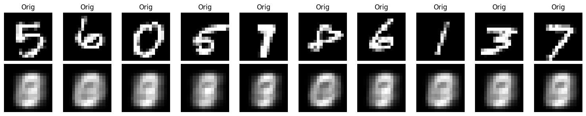
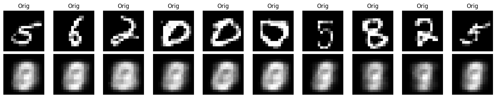
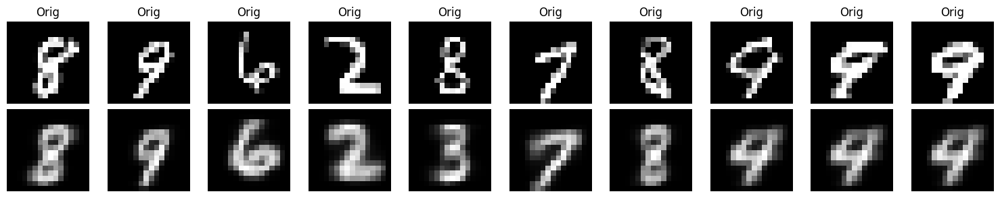
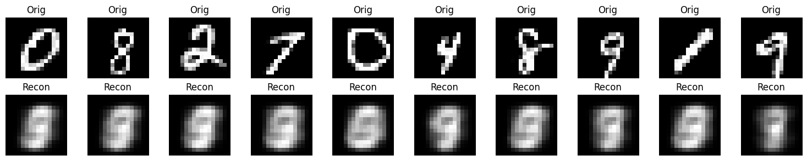
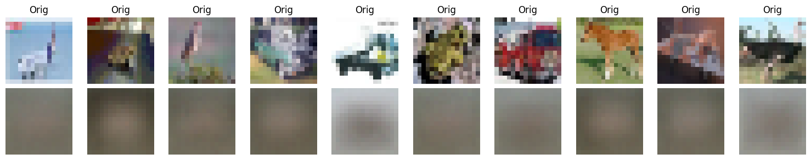

# NRT – Variational Autoencoders
> This test suite validates the implementation of every Variational Autoencoder architecture available in the project. Its objective is not to benchmark performance or achieve state-of-the-art results, but rather to ensure that every model trains correctly, produces coherent outputs, and can be safely saved and reloaded.
>
> The experiments use lightweight architectures and short training sessions to verify the complete training pipeline while keeping execution time low. Although the models are intentionally under-tuned, the generated samples still provide useful qualitative insights into the strengths and limitations of each architecture.


# Directory Structure
```text
NRT_VAEs/
├── outputs/
│   ├── blobs/
│   └── mnist/
│       ├── *.pth      # Saved model weights
│       ├── *.json     # Model configuration
│       └── *.png      # Reconstructions and generated samples
│
└── test.py
```


# What is validated?
Each test verifies the complete VAE workflow, including:
- Model initialization
- Encoder and decoder forward passes
- Latent sampling through the reparameterization trick
- Loss computation (reconstruction + KL divergence)
- Training loop execution
- Saving and loading checkpoints
- Configuration serialization
- Output tensor dimensions
- Image reconstruction
- Sample generation

The purpose is to detect implementation regressions rather than optimize reconstruction quality.


# MLP-VAE on Synthetic Blobs
```py
test_MLP_BaseVAE_blobs()
```
This lightweight experiment validates the complete VAE pipeline on a simple low-dimensional synthetic dataset.


# MLP-VAE on MNIST
```py
test_MLP_BaseVAE_mnist()
```

### Architecture
256 $\rightarrow$ 128 $\rightarrow$ 64 $\rightarrow$ Latent (32)

### Observations


The model successfully learns to reconstruct handwritten digits, confirming that the implementation is correct.

However, reconstructions remain noticeably blurry and generated samples exhibit limited diversity. The latent space tends to concentrate around a few common digit representations, resulting in repeated generations.

These limitations are expected since the objective of this test is functional validation rather than hyperparameter optimization.


# CNN-VAE on MNIST
```py
test_CNN_BaseVAE_mnist()
```

### Architecture
Replacing fully connected layers with convolutional encoders and decoders improves the spatial representation of images while validating the convolutional implementation.

### Observations


- Successful end-to-end training
- Stable reconstruction pipeline
- Correct latent sampling
- Proper checkpoint serialization

Despite the convolutional architecture, reconstruction quality remains with the same defaults as before due to the intentionally compact network and limited number of training epochs.


# VQ-VAE on MNIST
```py
test_VQ_VAE_mnist()
```

### Architecture
- Codebook size: **64 embeddings**
- Embedding dimension: **32**
- Commitment coefficient: **$\beta$ = 0.25**

Unlike standard VAEs, the latent representation is discretized through vector quantization.

### Observations


Among all tested VAE variants, the VQ-VAE produces the best qualitative reconstructions despite being trained for only **five epochs** as the previous were.

The discrete latent codebook enables sharper image reconstruction (a real learning made there) and more stable feature learning, illustrating one of the key advantages of vector-quantized latent representations.


# Fast CNN-VAE on MNIST
```py
test_fast_cnn_vae_mnist()
```

### Architecture
This implementation embeds the encoder and decoder directly within the model, reducing architectural flexibility in exchange for a simpler and faster implementation.

### Observations


- Reduced computational complexity
- Faster execution
- Successful reconstruction pipeline
- Stable training

The reconstruction quality remains comparable to the standard CNN-VAE, suggesting that the simplified architecture preserves functionality while reducing implementation overhead.
Yet no results can bee obtained with this limited hyperparameters choice.
The defaults remain vastly the one described previously in this unit testing recap.


# CNN-VAE on CIFAR-10
```py
test_CNN_BaseVAE_cifar10()
```

### Architecture
The same convolutional architecture used for MNIST is evaluated on the significantly more complex CIFAR-10 dataset.

### Observations


The model fails to learn meaningful image representations and primarily generates noisy outputs. This behavior is expected rather than indicative of an implementation issue.

Compared with MNIST, CIFAR-10 contains:
- RGB images instead of grayscale
- Greater intra-class variability
- Rich textures and object structures
- Higher information content

Successfully modeling such data generally requires substantially deeper architectures, larger latent spaces, longer training schedules, and significantly greater computational resources.

# Summary

| Model | Dataset | Status | Qualitative Result |
|--------|---------|:------:|--------------------|
| MLP-VAE | Blobs | ✅ | Correct latent representation learning |
| MLP-VAE | MNIST | ✅ | Functional but blurry reconstructions |
| CNN-VAE | MNIST | ✅ | Similar quality with improved spatial modeling |
| VQ-VAE | MNIST | ✅ | Best reconstruction quality among tested VAEs |
| FastCNNVAE | MNIST | ✅ | Lightweight implementation with comparable performance |
| CNN-VAE | CIFAR-10 | ✅ | Functional implementation, architecture too limited for dataset complexity |

> **Note:** These experiments are designed as **non-regression tests**, not performance benchmarks. 
The intentionally lightweight architectures and short training schedules prioritize execution speed and implementation validation over reconstruction quality. 
Nevertheless, the results provide useful qualitative comparisons between the different VAE variants and highlight the architectural changes required to tackle more challenging datasets.