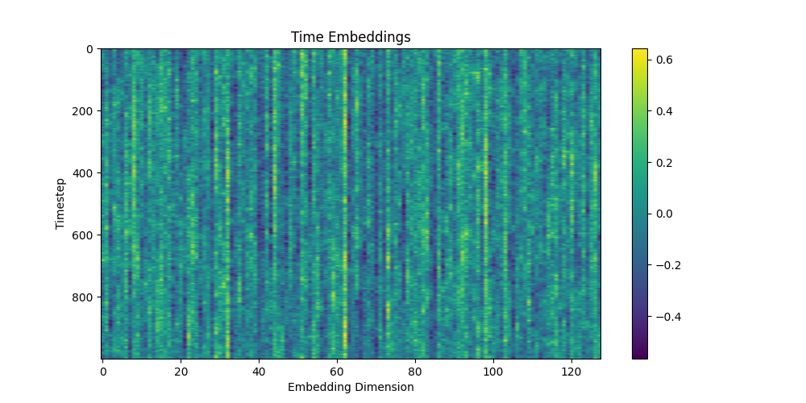
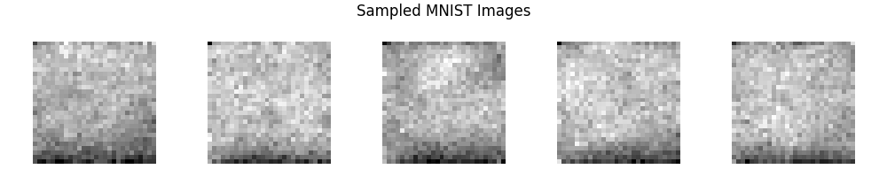
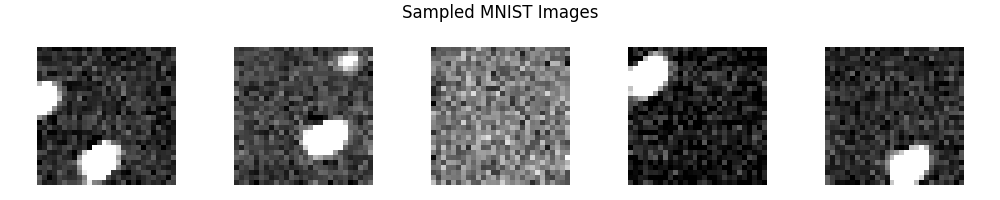
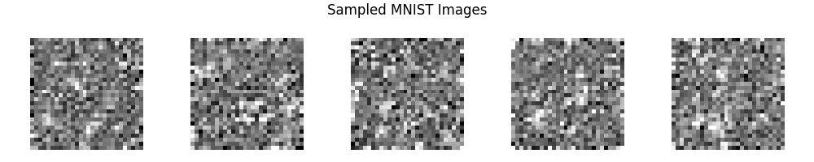
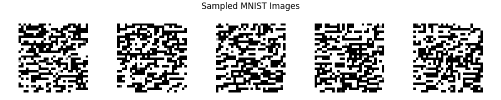
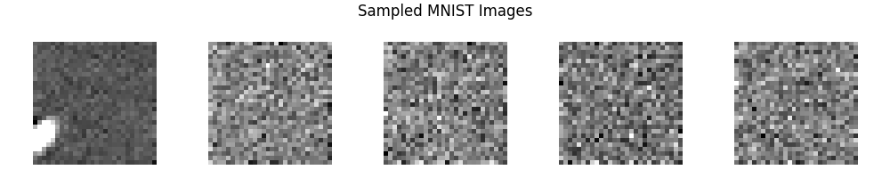
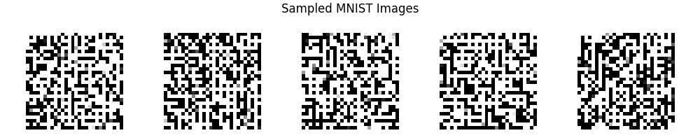
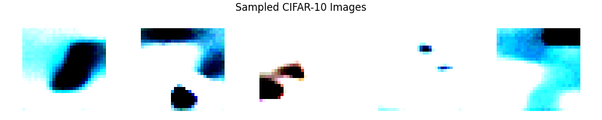
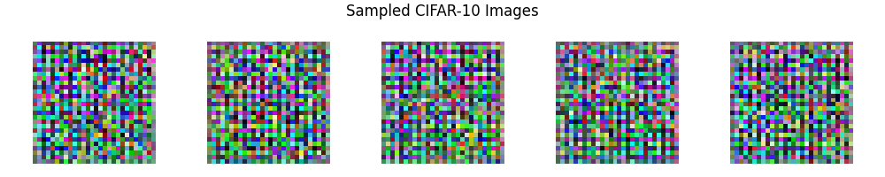

# NRT – Diffusion Models

> This test suite validates the implementation of the different Diffusion Model components and architectures available in the project. Its objective is not to benchmark performance or achieve state-of-the-art results, but rather to ensure that every component behaves correctly, can be trained end-to-end, produces outputs with the expected dimensions, and can be safely saved and reloaded.
>
> The experiments use lightweight architectures and short training sessions to keep execution time low while still exercising the complete diffusion pipeline.


# Directory Structure
```text
NRT_diffusion_models/
├── outputs/
│   └── *.png          # Generated samples and diagnostic plots
│
└── test.py
```


# What is validated?
The NRT suite covers the main components required to build a diffusion model:
- **Noise scheduling**
  - Linear and cosine schedules
  - $\beta_t$, $\alpha_t$ and $\bar{\alpha}_t$ computation
  - Forward noising process
- **Time embeddings**
  - Sinusoidal timestep encoding
  - MLP projection
- **Denoising networks**
  - CNN
  - Residual U-Net
  - Residual blocks
  - Attention blocks
  - Downsampling and upsampling blocks
  - Conditional and unconditional configurations
- **Latent diffusion**
  - Latent autoencoder
  - Image-to-latent and latent-to-image transformations
  - Latent dimensionality reduction
- **Exponential Moving Average (EMA)**
  - Parameter tracking
  - EMA model updates
  - Sampling with averaged parameters
- **Diffusion process**
  - Forward diffusion
  - Reverse denoising
  - DDPM sampling
  - DDIM sampling
- Training and checkpointing
  - Training step execution
  - Configuration serialization
  - Model saving/loading
- Output validation
  - Tensor dimensions
  - Generated image dimensions
  - End-to-end sample generation

The goal is to detect implementation regressions rather than evaluate final sample quality.


# Noise Scheduler 
```py
test_noise_scheduler()
```

### Architecture
The test uses a standard linear schedule:
```text
timesteps   = 1000
beta_start  = 1e-4
beta_end    = 2e-2
```
The noise variance gradually increases from a very small value at the beginning of the process to a much larger value at the end.

Conceptually:
```text
Clean image --> t=0 (almost no noise) --> t=250 --> t=500 --> t=750 --> t=999 (mostly Gaussian noise)
```

### Observations
The first and last values of the schedule are:
- $\beta_0 = 0.0001 \rightarrow \beta_{999} = 0.0200 $ 
- $\alpha_0 = 0.9999 \rightarrow \alpha_{999} = 0.9800 $ 

The important point is that $\beta_t$ increases monotonically, while $\alpha_t=1-\beta_t$ decreases correspondingly.
The schedule therefore implements the intended behavior:
- early timesteps preserve almost all information from the original image
- intermediate timesteps progressively destroy structure
- late timesteps contain substantially more noise
- the process eventually approaches an approximately Gaussian distribution

The test validates that the scheduler produces numerically consistent values and that the resulting forward diffusion process has the expected behavior.

### Why the schedule matters
The choice of $\beta_t$ strongly influences training and sampling. If too little noise is added, the model has difficulty learning meaningful denoising transformations. If too much noise is introduced too quickly, useful information can disappear before the model has enough intermediate states to learn the reverse process.


# Time Embedding
```py
test_time_embedding()
```

### Theory
Unlike a conventional image-to-image network, a diffusion model must know **which stage of the denoising process it is currently performing**. The same noisy image may require very different behavior depending on the timestep:
```text
Early timestep:
mostly clean image → remove a small amount of noise

Late timestep:
mostly noise → reconstruct large-scale structure
```
The timestep $t$ is therefore provided to the neural network through a dedicated **time embedding**.

The implementation first uses sinusoidal positional encoding to transform the scalar timestep into a high-dimensional representation. This is then passed through an MLP to obtain the final embedding used by the denoising network.

### Configuration
```text
embedding dimension = 128
number of timesteps = 1000
MLP expansion       = 4 × embedding dimension
```

The resulting embedding is therefore not simply a scalar representation of time. It provides the neural network with a rich representation of the current diffusion step.

### Observations



The test verifies that embeddings can be generated for the complete timestep range and that the resulting representation has the expected dimensions.
The sinusoidal structure provides a smooth representation of neighboring timesteps, which is useful because adjacent diffusion steps should generally correspond to similar denoising tasks.

# CNN Denoising Model
```py
test_cnn()
```
The first denoising architecture is a deliberately simple convolutional network. It provides a lightweight baseline before introducing the more sophisticated U-Net architecture.

### Architecture
```text
Input image --> Conv 1: 32 channels --> Conv 2: 64 channels --> Conv 3: 128 channels --> 1×1 Conv --> Predicted noise
```
Each convolution is followed by:
- Batch Normalization
- ReLU activation

The network also receives the timestep embedding. At each convolutional stage, the time embedding is projected to the corresponding number of feature channels and added to the feature map.

### Observations
For a batch of MNIST images:
```text
Input:
(4, 1, 28, 28)

Output:
(4, 1, 28, 28)
```

The test confirms that:
- convolutional feature extraction works correctly
- timestep conditioning is successfully incorporated
- spatial dimensions are preserved
- the network produces a valid noise prediction

The architecture is intentionally simple. It is useful for small images and for validating the diffusion pipeline, but it lacks the multi-scale representation and skip connections that make U-Nets considerably more effective for image generation.

# Residual U-Net
```py
test_unet()
```

The U-Net is the main denoising architecture implemented in the project. Compared with the simple CNN, it introduces **multi-scale feature extraction, residual connections, timestep conditioning and self-attention**.

The architecture follows the general structure:
```text
                       ┌───────────────────────────┐
                       │                           │
Input ──► Down ──► Down ──► Bottleneck ──► Up ──► Up ──► Output
           │          │          │            ▲       ▲
           └──────────┼──────────┼────────────┘       │
                      │          │                    │
                  Skip connections ───────────────────┘
```
The network first progressively reduces the spatial resolution while increasing the number of feature channels. The decoder then progressively restores the original resolution.
Skip connections transfer high-resolution information from the encoder to the decoder, helping preserve fine-grained spatial structure.

### Residual Blocks
Each stage is built from residual blocks.
A typical block contains:
```text
Input
  │
  ├─────────────── Skip connection ───────────────┐
  │                                               │
  ▼                                               │
GroupNorm → SiLU → Conv                           │
  │                                               │
  ├────── Timestep embedding ─────────────────────┤
  │                                               │
  ▼                                               │
GroupNorm → SiLU → Dropout → Conv                 │
  │                                               │
  └─────────────────────── + ◄────────────────────┘
                           │
                           ▼
                        Output
```
The residual formulation helps optimization by allowing the block to learn a residual transformation instead of an entirely new representation.

In the tested configuration:
```text
Input channels  : 32
Output channels : 64
Time embedding  : 128
Normalization   : GroupNorm
Activation      : SiLU
Dropout         : 0.1
Kernel          : 3×3
```
The test confirms both the channel transformation and the preservation of the expected spatial dimensions.

### Attention Blocks
The U-Net also supports self-attention at selected spatial resolutions.
The attention block consists of:
```text
Feature map --> GroupNorm --> Multi-Head Self-Attention --> Feature map
```
Self-attention allows distant spatial locations to interact directly.
This is particularly useful when image structures contain long-range dependencies that local convolutions may struggle to capture.

Attention is not applied at every resolution. Instead, the configuration specifies the resolutions at which it should be enabled:
```py
attention_resolutions = (8,) # applied if = input_size / (2**i)
num_heads = 4
```
This limits the computational cost of attention while still allowing global interactions at a sufficiently compressed representation.

### Downsampling Blocks
A `DownBlock` combines:
1. Residual blocks
2. Optional attention
3. Spatial downsampling
4. Skip-feature extraction
```text
Input (4, 64, 28, 28)
       │
       ▼
Residual Block
       │
       ▼
Attention
       │
       ├────────► Skip
       │          (4, 128, 28, 28)
       ▼
Downsample
       │
       ▼
(4, 128, 14, 14)
```
The test confirms that the spatial resolution is reduced from `28×28` to `14×14` while the number of channels increases from `64` to `128`.
```py
x = torch.randn(4, 64, 28, 28)
t_emb = torch.randn(4, 128)
```
```text
DownBlock output shape: torch.Size([4, 128, 14, 14])
DownBlock skip connection shape: torch.Size([4, 128, 28, 28])
```

### Upsampling Blocks
The decoder performs the inverse operation.
A typical `UpBlock`:
1. Upsamples the feature map
2. Concatenates the corresponding encoder skip connection
3. Processes the combined representation through residual blocks
4. Optionally applies attention
```text
Bottleneck
(4, 128, 14, 14)
       │
       ▼
Upsample
       │
       ▼
(4, 64, 28, 28)
       │
       │      Skip connection
       │            ▲
       └─────── + ──┘
                │
                ▼
          Residual Block
                │
                ▼
          (4, 64, 28, 28)
```
The test confirms that the block correctly reconstructs the original spatial resolution and handles the increased number of channels introduced by concatenating the skip connection.
```py
x = torch.randn(4, 128, 14, 14) # input from previous UpBlock or bottleneck (bottleneck size is 14x14)
skip = torch.randn(4, 128, 28, 28) # skip connection from DownBlock
t_emb = torch.randn(4, 128)
```
```text
UpBlock output shape: torch.Size([4, 64, 28, 28])
```

### Complete U-Net
The tested U-Net uses:
```text
Input channels       : 1
Base channels        : 32
Channel multipliers  : [1, 2]
Image size            : 28 × 28
Time embedding        : 128
Residual blocks       : 1 per level
Attention             : enabled
Attention resolution  : 8 × 8
Attention heads       : 4
Normalization         : GroupNorm
Activation             : SiLU
```
The resulting channel progression is approximately:
```text
Input: 28×28, 1 channel
  │
  ▼
Initial conv → 28×28, 32 channels
  │
  ├─ DownBlock 1: ResBlock + Attention
  │     └─ Skip 1 (saved for UpBlock 1)
  │
  ▼
Downsample → 14×14, 32 channels
  │
  ├─ DownBlock 2: ResBlock + Attention
  │
  ▼
Bottleneck: ResBlock + Attention + ResBlock
  │
  ▼
Upsample → 14×14, 64 channels
  │
  ├─ UpBlock 1: concat Skip 1 + ResBlock + Attention
  │
  ▼
Upsample → 28×28, 32 channels
  │
  ├─ UpBlock 2: ResBlock
  │
  ▼
Output: 28×28, 1 channel
```
The final network therefore maps $(4, 1, 28, 28)$ to $(4, 1, 28, 28)$
while conditioning the prediction on the diffusion timestep.
```py
x = torch.randn(4, 1, 28, 28) # batch of 4 MNIST images
t_emb = torch.randint(0, 1000, (4,))  # random timesteps for each image
output = unet(x, t_emb)
```

### Conditional Generation
The implementation also supports conditional generation by incorporating class information into the conditioning pathway.
The same denoising architecture can therefore be used in two modes:
```text
Unconditional:
image + timestep → predicted noise

Conditional:
image + timestep + class → predicted noise
```
The NRT verifies both configurations to ensure that introducing conditioning does not break the underlying U-Net architecture.


# Latent Autoencoder
```py
test_latent_autoencoder()
```
Latent diffusion reduces the computational cost of diffusion by performing the denoising process in a compressed latent space instead of directly operating on pixels.
This separates **representation learning** from **generative modeling**.

The workflow becomes: $x \rightarrow z \rightarrow \text{diffusion} \rightarrow \hat z \rightarrow \hat x$
```text
Image --> Encoder --> Latent representation --> Diffusion model --> Denoised latent --> Decoder --> Generated image
```

The NRT uses:
```py
in_c        = 1
latent_dim  = 16
hidden_dim  = 32
kernel_size = 4
stride      = 2
padding     = 1
```
The encoder progressively downsamples the image while the decoder performs the inverse transformation:
```text
Conv into (4, 32, 14, 14)
Encoded latent shape: (4, 16, 7, 7)

ConvTranspose into (4, 32, 14, 14)
Reconstructed image shape: (4, 1, 28, 28)
```
The latent scaling factor scale_factor = 0.18215 is applied to keep latent activations in a suitable numerical range for diffusion.


# Exponential Moving Average (EMA)
```py
test_ema()
```
The EMA model therefore changes more slowly than the training model and acts as a smoothed version of the learned parameters.

Conceptually:
```text
Training model
      │
      │ optimizer update
      ▼
   θ(t)
      │
      ▼
   EMA update
      │
      ▼
 θEMA(t)
      │
      ▼
Sampling / evaluation
```
The EMA model is particularly useful for diffusion models because sampling can be sensitive to small parameter fluctuations. Using averaged parameters often produces more stable generations.

The NRT verifies that:
- EMA parameters are initialized correctly
- parameters are updated after training steps
- EMA weights remain synchronized with the model structure
- the EMA model can be used independently for sampling


# CNN Diffusion Model on MNIST
```py
test_diffusion_model_mnist_cnn()
```

### Architecture
This experiment uses the lightweight convolutional diffusion model introduced in the previous section on a subset on the MNIST dataset to avoid too long computation times.
The timestep is encoded using the sinusoidal `TimeEmbedding` class and projected into each convolutional feature space.
This architecture keeps the spatial resolution constant throughout the network and therefore provides a simple baseline for validating the complete diffusion training and sampling pipeline.

### Observations
The model successfully completes the complete workflow:
```text
MNIST --> forward diffusion --> noise prediction --> reverse diffusion --> generated images
```
The generated samples are only noise, lack the precision and diversity expected from a well-trained diffusion model. This is expected for this NRT setup: the model is deliberately small and trained for only a short number of iterations on CPU.
The main purpose of this experiment is therefore to verify that a simple timestep-conditioned CNN is sufficient to run the diffusion process end-to-end.




# Residual U-Net Diffusion Model on MNIST
```py
test_diffusion_model_mnist_resunet()
```

### Architecture
This experiment replaces the simple CNN with the residual U-Net architecture described previously.

### Observations
The main purpose of this test is to verify that the more complex residual U-Net can replace the basic CNN without modifying the surrounding diffusion pipeline, because here nothing is learned effectively even though it's not only blur anymore, some white patchs are forming among a full black background.
Another important architectural point: increasing the capacity of the denoising network is generally more useful than simply increasing the number of diffusion timesteps when the network itself is unable to model the image distribution effectively.




# Residual U-Net with Attention and DDIM Sampling
```py
test_diffusion_model_mnist_resunet_attention_ddim()
```

### Architecture
This experiment extends the previous U-Net by enabling self-attention at selected spatial resolutions.
The architecture therefore combines:
```text
Residual convolutions
        +
Multi-scale U-Net
        +
Self-attention
        +
Timestep conditioning
```
Attention is only applied at selected resolutions rather than at every layer. This is important because the computational cost of self-attention increases rapidly with the number of spatial positions.

The experiment also switches the sampling procedure from standard DDPM sampling to DDIM sampling.

### DDPM vs DDIM
A standard DDPM sampler progressively applies the learned reverse diffusion process over many timesteps.
DDIM provides an alternative sampling formulation that can use substantially fewer denoising steps:
DDPM:
```text
t=999 → 998 → 997 → ... → 1 → 0
```
DDIM:
```text
t=999 → ... → 950 → 900 → ... → 50 → 0
```
The model itself is still trained using the diffusion objective. DDIM mainly changes how the learned model is used during inference.

### Observations
Adding attention increases the representational capacity of the U-Net, allowing features at different spatial locations to interact directly.
The use of DDIM also demonstrates that sampling does not necessarily require running the entire 1000-step diffusion chain.

This all is valid only in the case of a well trained model which is not the case here, we're back to full blur.

Because this is still a lightweight CPU experiment, the generated images should not be interpreted as a comparison of DDPM versus DDIM sample quality. The important validation is that:
- attention can be integrated into the U-Net
- the model remains compatible with the diffusion training pipeline
- DDIM sampling can use the trained model
- reduced-step sampling produces valid images with the expected dimensions




# Residual U-Net with EMA
```py
test_diffusion_model_mnist_resunet_ema()
```

### Architecture
This experiment uses the same residual U-Net architecture but enables an Exponential Moving Average (EMA) of the model parameters.
During training, two parameter sets are maintained:
```text
                    ┌─────────────────┐
                    │ Training model  │
                    └────────┬────────┘
                             │
                    optimizer update
                             │
                             ▼
                    ┌─────────────────┐
                    │ Current weights │
                    └────────┬────────┘
                             │
                         EMA update
                             │
                             ▼
                    ┌─────────────────┐
                    │   EMA weights   │
                    └─────────────────┘
                             │
                             ▼
                          Sampling
```
The EMA parameters are updated using:
$\theta_{\mathrm{EMA}} \leftarrow \gamma\theta_{\mathrm{EMA}} + (1-\gamma)\theta$
The EMA model therefore behaves as a smoothed version of the training model.

### Observations
The test validates that EMA can be enabled without changing the training interface or the underlying U-Net architecture.

Sampling from the EMA parameters generally produces more stable results because short-term fluctuations in the training parameters are smoothed out, here it's more looking like a QR code.

As with the other experiments, the short CPU training schedule limits the final quality considerably. The purpose of the test is primarily to ensure that:
- EMA parameters are updated correctly
- EMA state can be saved and restored
- sampling can be performed using EMA weights
- enabling EMA does not break training




# 
```py
test_diffusion_model_mnist_resunet_conditional()
```

### Architecture
This experiment introduces class conditioning into the residual U-Net.
For MNIST, the model receives the digit class in addition to the noisy image and timestep:
```text
Noisy image ───────────────┐
                           │
Timestep ──► Time embedding│
                           ├──► U-Net ──► Predicted noise
Class label ─► Conditioning│
                           │
```
Instead of learning only $\epsilon_\theta(x_t,t)$, the model learns a conditional noise prediction: $\epsilon_\theta(x_t,t,y)$ where $y$ represents the desired class.
This allows the same diffusion model to model all ten MNIST classes while providing information about which class should be generated.

### Observations
The experiment validates the conditional branch of the diffusion architecture.

The model can be requested to generate samples associated with a particular digit class, demonstrating that class information can be incorporated into the denoising process.

This is an important extension over unconditional generation: the model no longer only learns what MNIST images look like, but can also learn the relationship between the image distribution and an explicit semantic condition.

The short training schedule limits how strongly the conditioning can be learned, so the outputs should again be interpreted primarily as a functional test rather than a measure of conditional generation quality, since we're back to blurry outputs there.




# Latent Diffusion Model on MNIST
```py
test_diffusion_model_mnist_latent_diffusion()
```

### Architecture
This experiment moves the diffusion process from pixel space into a learned latent space.
Instead of:
```text
Image → Diffusion U-Net → Image
```
the complete pipeline becomes:
```text
                 Latent space
              ┌───────────────┐
              │               │
Image → Encoder → Latent → Diffusion → Denoised latent
  ▲                                      │
  │                                      ▼
  └──────────── Decoder ◄────────────────┘
```
The latent autoencoder compresses the original image before the diffusion model processes it.
For the NRT configuration:
```text
Image: (1, 28, 28)
Latent: (16, 7, 7)
```
The diffusion U-Net therefore operates on the latent representation rather than directly on the original image.

## Why latent diffusion?
The motivation becomes increasingly important for larger images.
The number of spatial elements is reduced from $28\times28 = 784$ to $16\times7\times7 = 784$ in this particular small MNIST configuration. 
Although this specific example does not provide a dramatic reduction in the total number of scalar values, it demonstrates the mechanism used by larger latent diffusion systems, where the spatial compression can be much more substantial.
The important architectural separation is:
- the autoencoder learns an image representation
- the diffusion model learns the distribution of those representations
- the decoder converts generated latent representations back into images

### Observations
The test validates the complete latent diffusion pipeline.This confirms that the diffusion model can operate on tensors whose spatial dimensions and number of channels differ from the original image.
The output quality remains limited by the short training schedule and the small autoencoder. Nevertheless, the experiment verifies the architectural principle behind latent diffusion.




# Residual U-Net Diffusion Model on CIFAR-10
```py
test_diffusion_model_cifar10_resunet()
```

### Architecture
This experiment transfers the residual U-Net diffusion model from grayscale MNIST to RGB CIFAR-10 images.
The main change is the input/output dimensionality:
```text
MNIST: 1 × 28 × 28
CIFAR-10: 3 × 32 × 32
```
The denoising model therefore predicts three-channel noise:
```text
Noisy RGB image
      │
      ▼
Residual U-Net
      │
      ▼
Predicted RGB noise
```
The multi-scale architecture becomes more important for CIFAR-10 because the dataset contains substantially more visual variation than MNIST.
Instead of learning mostly simple digit contours, the model must represent:
- multiple object categories
- different shapes
- colors
- textures
- spatial arrangements

### Observations
The CIFAR-10 experiment is considerably more demanding than the MNIST experiments.

With the same general philosophy of lightweight architecture and short CPU training, the generated samples are expected to remain noisy or blurry. This is not evidence that the architecture is incorrect. Rather, it illustrates the relationship between:
```text
Dataset complexity
        ↓
Required model capacity
        ↓
Required training time
        ↓
Required computational resources
```
A model that can produce recognizable MNIST digits after a short training session generally requires substantially more capacity and optimization time to model CIFAR-10 successfully as seen with the GANs in the `NRT_GANs` part for example.
The NRT therefore confirms that the same diffusion pipeline generalizes from grayscale to RGB images and from a simple dataset to a significantly more complex one, since it takes more time to come to the same noise.




# Conditional Latent Diffusion with DDIM and EMA on CIFAR-10
```py
test_diffusion_model_cifar10_latent_diffusion_ddim_ema_conditional()
```

### Architecture
This is the most complete diffusion configuration tested in the NRT suite.
It combines:
- **Residual U-Net**
- **latent diffusion**
- **class conditioning**
- **DDIM sampling**
- **EMA sampling**

The complete pipeline is:
```text
                         Class label
                              │
                              ▼
Image ──► Encoder ──► Latent representation
                              │
                              ▼
                     Conditional U-Net
                              │
                    DDIM reverse process
                              │
                         EMA weights
                              │
                              ▼
                     Generated latent
                              │
                              ▼
                          Decoder
                              │
                              ▼
                       Generated image
```
During training, the diffusion model operates entirely in latent space. During inference, the denoised latent is decoded back into an RGB image.
The combination of these techniques illustrates how the different components of the project can be composed without changing the high-level interface of the diffusion model.

### Observations
This test is primarily an integration test for the complete diffusion stack.
It verifies that the following components work together.

The generated samples are not expected to be high quality because this configuration combines the most computationally demanding components while still using a deliberately short CPU training schedule. Yet, there we obtained something quite different than the previous model on CIFAR-10 instead of colored spots, we have some randomly colored QR codes.

The experiment is nevertheless useful because it exercises interactions that are not covered by the individual unit tests. In particular, it validates that:
- conditioning works in latent space
- the U-Net correctly handles latent dimensions
- EMA can be combined with latent diffusion
- DDIM can sample the latent representation
- the decoded output returns to the expected RGB image dimensions
- the complete configuration can be saved and restored




# Summary

### Summary of Component Tests
| Component | Main validation |
|-----------|-----------------|
| **Noise Scheduler** | Correct $\beta$, $\alpha$ and cumulative schedules |
| **Time Embedding** | Valid timestep representation |
| **CNN** | Basic timestep-conditioned noise prediction |
| **ResBlock** | Residual transformation and timestep conditioning |
| **AttentionBlock** | Multi-head spatial attention |
| **DownBlock** | Downsampling and skip extraction |
| **UpBlock** | Upsampling and skip fusion |
| **U-Net** | Complete multi-scale denoising architecture |
| **Latent Autoencoder** | Image latent dimensionality transformation |
| **EMA** | Parameter averaging and sampling model |

### Summary of Model Tests

| Experiment | Main purpose	| Additional components |
|------------|--------------|-----------------------|
| **MNIST CNN** | Validate the basic diffusion pipeline | CNN + timestep conditioning |
| **MNIST ResU-Net** | Validate multi-scale denoising | ResBlocks + U-Net + skip connections |
| **MNIST ResU-Net + Attention + DDIM** | Validate attention and accelerated sampling | Self-attention + DDIM |
| **MNIST ResU-Net + EMA** | Validate averaged model parameters | EMA |
| **MNIST Conditional ResU-Net** | Validate class-conditioned generation | Class conditioning |
| **MNIST Latent Diffusion** | Validate diffusion in latent space | Latent Autoencoder |
| **CIFAR-10 ResU-Net** | Validate RGB and more complex data | ResU-Net + RGB input |
| **CIFAR-10 Full Pipeline** | Validate complete integration	| Latent Diffusion + Conditional U-Net + DDIM + EMA |

### Notes 
> **Note**: These experiments are designed as **non-regression tests, not performance benchmarks**.
>
> The architectures are intentionally lightweight and the training schedules are deliberately short so that the tests can be executed quickly, including on CPU. Consequently, generated samples should not be interpreted as representative of the final quality achievable by diffusion models with appropriate hyperparameter tuning, larger architectures, longer training, or GPU acceleration.
>
> The qualitative outputs are nevertheless useful for understanding the effect of increasing architectural complexity. The progression from a simple CNN to a residual U-Net, attention, conditioning, latent diffusion, DDIM and EMA demonstrates how the different components of a modern diffusion pipeline fit together.
>
> In particular, the experiments highlight that dataset complexity strongly affects the resources required for useful generation. MNIST can be modeled with relatively small networks, whereas CIFAR-10 requires substantially greater model capacity and training time. The blurry or noisy outputs observed in some tests therefore primarily reflect the intentionally constrained NRT setup rather than a limitation of the underlying diffusion architectures.