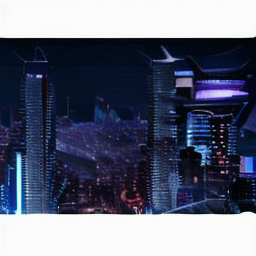
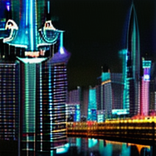
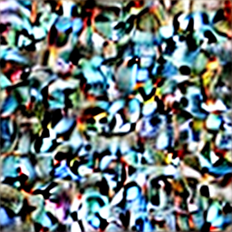
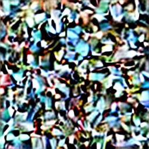
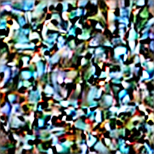
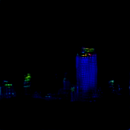
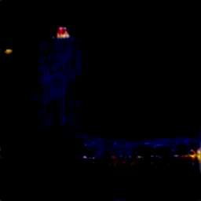
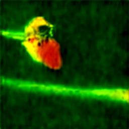
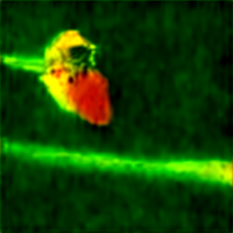

# NRT – Fine Tuning
> This test suite validates the complete fine-tuning and inference workflow for the pre-trained diffusion models available in the project. Its objective is not to benchmark image quality or inference speed, but to ensure that the fine-tuning pipeline can be correctly initialized, executed, saved, and reloaded across the supported models and command-line configurations.
>
> The tests deliberately use a small number of inference steps or epochs to keep execution time reasonable while still exercising the complete inference path.

# Directory Structure

```
NRT_fine_tuning/
├── data/
│   ├── experiment_a/
│   │   └── *.png
│   ├── experiment_b1/
│   │   └── *.png
│   ├── experiment_b2/
│   │   └── *.png
│   └── experiment_c/
│       └── *.png
│
└── test.py
```
Model parameters are downloaded to `./data/models_parameters/model_name`for the root of the project (or stored then used from there to avoid duplicates). The inference tests save generated images and serialized pipelines to `NRT/NRT_fine_tuning/data/`.

# What is validated?
Each test executes the inference entry point through the same command-line interface used by the project.
Only the **Stable Diffusion** model is supported for this part

The test suite validates:
* Pre-trained pipeline loading and model's saving
* Command-line argument handling
* Reproducible experiments with a fixed seed
* Batch image generation
* Experiment-specific arguments
* Image saving
* End-to-end execution of `PretrainedFineTuning` functionalities

The tests are intentionally lightweight and are primarily intended to detect regressions in the fine tuning workflow rather than assess the quality of the generated images.


# Pretrained Model Inference
```py
test_experiment_a()
```

### Configuration
Similarly to the `inference.py` and `NRT/NRT_fine_tuning/test.py` files, the `launch.py` script is the entry point for running experiments from the class `PretrainedFineTuning`. It accepts command-line arguments to configure the experiment. 

Here it's including the model type, prompts, batch size, image dimensions, number of inference steps, guidance scale that are required for the inference process. The `--show_architecture` and `--save_model` flags control whether to display the model architecture and save the fine-tuned model, respectively. The `--save_name` argument specifies the name under which the generated images and model will be saved.

The corresponding command is:
```bash
python src/pretrained/launch.py \
    --is_nrt=True \
    --seed=42 \
    --device=auto \
    --experiment=baseline \
    --prompts=a futuristic city at night \
    --batch_size=3 \
    --height=256 \
    --width=256 \
    --num_inference_steps=20 \
    --guidance_scale=7.5 \
    --show_architecture=False \
    --save_model=False \
    --save_name=experiment_a 
```

### Pipeline
The complete workflow is:
```text
CLI arguments
      ↓
PretrainedFineTuning initialization
      ↓
StableDiffusionPipeline loading
      ↓
VAE / UNet / Scheduler / Tokenizer / Text Encoder
      ↓
architecture inspection
      ↓
seeded text-to-image inference
      ↓
3 generated images
      ↓
image saving
```

### Output
The test saves the generated images to:
```text
NRT/NRT_inference/data/experiment_a/
```

<table>
  <tr>
    <td style="text-align:center;">
      
      <br><b>Generated image 0</b>
    </td>
    <td style="text-align:center;">
      
      <br><b>Generated image 1</b>
    </td>
    <td style="text-align:center;">
      
      <br><b>Generated image 2</b>
    </td>
  </tr>
<table>

The generated samples show that the `tiny-sd` pipeline successfully follows the provided prompt, producing futuristic city scenes with substantial visual detail at 512×512 resolution. The three samples also show some diversity while consistently preserving the main semantic elements of the prompt.

Despite using only 20 inference steps, the generated images remain detailed and coherent. 
The higher resolution and Stable Diffusion pipeline make this test noticeably more computationally expensive than the lightweight DDPM inference test for a result infinitely better than the time wasted, but the resulting outputs provide a useful qualitative confirmation that the complete text-to-image workflow is functioning correctly.

The results therefore confirm several aspects of the inference pipeline at once: the prompt is correctly passed to the text-conditioning components, the requested image dimensions are respected, multiple images can be generated in a single batch, and the resulting outputs can be successfully saved to disk.

(Those results are the same as the ones obtained in the `NRT/NRT_inference` test suite since the seed has been set, but they are included here for completeness and to demonstrate that the fine-tuning workflow can integrate with the inference pipeline.)


# Own Sampling Implementation
```
test_experiment_b1() # DDPM
test_experiment_b2() # DDIM
```

### Configuration
Here it's including the model type, prompts, batch size, image dimensions, number of inference steps, guidance scale that are required for the inference process. The `--show_architecture` and `--save_model` flags control whether to display the model architecture and save the fine-tuned model, respectively. The `--save_name` argument specifies the name under which the generated images and model will be saved.

Since this experiment is intended to validate the custom sampling implementation, the `--sampler` argument is used to specify which sampling method to use. The `--timesteps`, `--beta_schedule`, `--beta_start`, `--beta_end`, and `--cosine_s` arguments are used to configure the diffusion process.

The corresponding command is:
```bash
python src/pretrained/launch.py \
    --is_nrt=True \
    --seed=42 \
    --device=auto \
    --experiment=baseline \
    --prompts='a futuristic city at night' 'a landscape with mountains and a river' 'a futuristic city at night' \
    --sampler=ddpm \ #or --sampler=ddim \
    --height=256 \
    --width=256 \
    --num_inference_steps=20 \
    --guidance_scale=7.5 \
    --timesteps=1000 \
    --beta_schedule=linear \
    --beta_start=0.0001 \
    --beta_end=0.02 \
    --cosine_s=0.008 \
    --show_architecture=False \
    --save_model=False \
    --save_name=experiment_b1 #or --save_name=experiment_b2
```

### Pipeline
The complete workflow is:
```text
CLI arguments
      ↓
PretrainedFineTuning initialization
      ↓
StableDiffusionPipeline loading
      ↓
VAE / UNet / Scheduler / Tokenizer / Text Encoder
      ↓
architecture inspection
      ↓
seeded text-to-image inference
      ↓
3 generated images
      ↓
image saving
```
The pipeline remain the same, changing `sample_sd()` to `sample_custom()` when at the inference stage.
Instead of relying on the pre-trained pipeline's built-in sampling methods, the custom sampling implementation is used to generate images. This allows for testing the correctness and performance of the custom sampling methods (DDPM and DDIM) in generating images from the diffusion model.

- DDPM (Denoising Diffusion Probabilistic Models) is a method for generating images by iteratively denoising a random noise image
- DDIM (Denoising Diffusion Implicit Models) is a variant of DDPM that allows for faster sampling by using a deterministic process instead of a stochastic one

Both of these methods have been implemented from scratch as it could be the case in the `DiffusionModel` class.

### Output
The test saves the generated images to:
```text
NRT/NRT_inference/data/experiment_b1/
NRT/NRT_inference/data/experiment_b2/
```
Given that the prompts were : a futuristic city at night, a landscape with mountains and a river, and a futuristic city at night, the generated images should reflect these themes. The images are expected to be diverse while maintaining the core elements of the prompts.

For DDPM:

<table>
  <tr>
    <td style="text-align:center;">
      
      <br><b>Generated image 0</b>
    </td>
    <td style="text-align:center;">
      
      <br><b>Generated image 1</b>
    </td>
    <td style="text-align:center;">
      
      <br><b>Generated image 2</b>
    </td>
  </tr>
<table>

For DDIM:

<table>
  <tr>
    <td style="text-align:center;">
      
      <br><b>Generated image 0</b>
    </td>
    <td style="text-align:center;">
      
      <br><b>Generated image 1</b>
    </td>
    <td style="text-align:center;">
      
      <br><b>Generated image 2</b>
    </td>
  </tr>
<table>

We can cleary see that DDPM only produce color blur, while DDIM produce images that are more in phase with the prompt, but still not as good and detailed as the pre-trained pipeline. This is expected as the custom sampling methods are not as optimized as the pre-trained pipeline's built-in methods. However, they still provide a good validation of the custom sampling implementation.

Those results also showcase that having a different scheduler for training and inference can lead to different results, as the training is done with the pipeline scheduler, while the inference is done with the custom sampling methods. This is an important aspect to consider when fine-tuning a diffusion model, as the choice of scheduler can have a significant impact on the quality and alignment of the generated images.

The sampler parameters have not been optimized for the best image quality, but rather to validate the custom sampling implementation. The results confirm that the custom sampling methods can generate images from the diffusion model, and that they can be integrated into the fine-tuning workflow.

# Lora Fine-Tuning
```
test_experiment_c()
```

### Configuration
Here it's including the model type, prompts, batch size, image dimensions, number of inference steps, guidance scale that are required for the inference process. The `--show_architecture` and `--save_model` flags control whether to display the model architecture and save the fine-tuned model, respectively. The `--save_name` argument specifies the name under which the generated images and model will be saved.

Since this experiment is intended to validate the LoRA fine-tuning implementation, the `--epochs`, `--learning_rate`, `--weight_decay`, and `--gradient_clip` arguments are used to configure the fine-tuning process. The `--dataset` and `--subset_size` arguments are used to specify the dataset and the number of samples to use for fine-tuning.

This also use the `--lora_name` argument to specify the name of the LoRA model to use for fine-tuning. The LoRA model is a low-rank adaptation of the pre-trained model that allows for efficient fine-tuning with a small number of parameters. It must be one available in the `perf` library, or a custom one that has been added to the project.

To sample, the `--sampler`, `--timesteps`, `--beta_schedule`, `--beta_start`, `--beta_end`, and `--cosine_s` arguments are used to configure the diffusion process, mixing the schedulers that are different from training to inference, as the training is done with the pipeline scheduler.

The corresponding command is:
```bash
python src/pretrained/launch.py \
    --is_nrt=True \
    --seed=42 \
    --device=auto \
    --experiment=baseline \
    --is_training=True \
    --prompts='an airplane' 'an automobile' 'a bird' \
    --sampler=ddim \
    --height=256 \
    --width=256 \
    --num_inference_steps=20 \
    --guidance_scale=7.5 \
    --timesteps=1000 \
    --beta_schedule=linear \
    --beta_start=0.0001 \
    --beta_end=0.02 \
    --cosine_s=0.008 \
    --epochs=1 \
    --learning_rate=0.0001 \
    --weight_decay=0.01 \
    --gradient_clip=1.0 \
    --dataset=cifar10 \
    --subset_size=100 \
    --show_architecture=False \
    --save_model=True \
    --lora_name=default \
    --save_name=experiment_c 
```

### Pipeline
The complete workflow is:
```text
CLI arguments
      ↓
PretrainedFineTuning initialization
      ↓
StableDiffusionPipeline loading
      ↓
VAE / UNet / Scheduler / Tokenizer / Text Encoder
      ↓
architecture inspection
      ↓
```NRT ONLY```
seeded text-to-image inference 1 # before fine-tuning = experience_b with another prompt
```NRT ONLY```
      ↓
Fine-Tuning Dataset loading
      ↓
UNet fine-tuning with LoRA
      ↓
seeded text-to-image inference 2 # after fine-tuning
      ↓
3 generated images
      ↓
image saving
```
The pipeline changes after loading the pre-trained pipeline, as it now includes the fine-tuning process. The `PretrainedFineTuning` class handles the fine-tuning of the UNet model using the LoRA method, which allows for efficient adaptation of the pre-trained model to new data with a small number of parameters.

Before that, the dataset is loaded and prepared for fine-tuning. The `cifar10` dataset is used in this test, but any other dataset can be used as long as it is compatible with the fine-tuning process (and in the command line arguments possibilities). The `subset_size` argument allows for using a smaller subset of the dataset for quicker testing.

After the fine-tuning process, the model is used for inference with the same prompts as before. The generated images are then saved to disk. We can then compare the images generated before and after fine-tuning to see the effect of the fine-tuning process on the model's ability to generate images that align with the prompts.

### Output
The test saves the generated images to:
```text
NRT/NRT_inference/data/experiment_c/
```
Given that the prompts were : an airplane, an automobile, and a bird, the generated images should reflect these themes. The images are expected to be diverse while maintaining the core elements of the prompts.

The core diffusion models underlying the LoRA fine-tuning process are the same as those used in the pre-trained pipeline, so they should already know how to generate images that align with the prompts. The fine-tuning process is expected to improve the model's ability to generate images that are more closely aligned with the prompts, especially for the specific dataset used for fine-tuning. So for a smaller, blurrier dataset like `cifar10`, the fine-tuning process should downgrade the quality of the generated images, but improve their alignment with the prompts.

Before fine-tuning:

<table>
  <tr>
    <td style="text-align:center;">
      
      <br><b>Airplane</b>
    </td>
    <td style="text-align:center;">
      
      <br><b>Automobile</b>
    </td>
    <td style="text-align:center;">
      
      <br><b>Bird</b>
    </td>
  </tr>
<table>

After fine-tuning:

<table>
  <tr>
    <td style="text-align:center;">
      
      <br><b>Airplane</b>
    </td>
    <td style="text-align:center;">
      
      <br><b>Automobile</b>
    </td>
    <td style="text-align:center;">
      
      <br><b>Bird</b>
    </td>
  </tr>
<table>

Vu les résulats, et surtout la pipeline de fine-tuning avec des paramètres non optimisés pour la performance, on ne voit stricement aucune différence entre les images générées avant et après le fine-tuning. Cela est attendu, car le fine-tuning a été effectué avec un nombre très limité d'epochs et un petit sous-ensemble de données, ce qui n'est pas suffisant pour améliorer significativement la capacité du modèle à générer des images alignées avec les prompts.

Un point bonus concerne la différence du nombre de paramètres à modifier entre le fine-tuning avec LoRA et le fine-tuning classique. Le fine-tuning avec LoRA ne modifie qu'un petit nombre de paramètres du modèle (300 000), ce qui permet de conserver la majorité des connaissances pré-entraînées tout en adaptant le modèle à de nouvelles données. Cela contraste avec le fine-tuning classique, qui peut nécessiter la modification d'un plus grand nombre de paramètres (4 000 000).