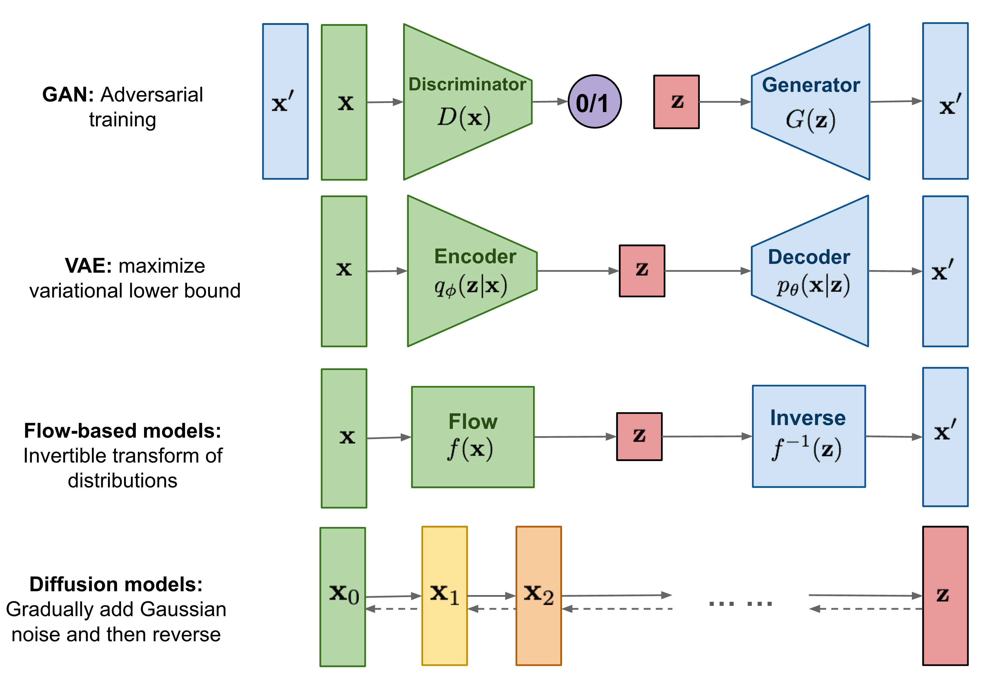
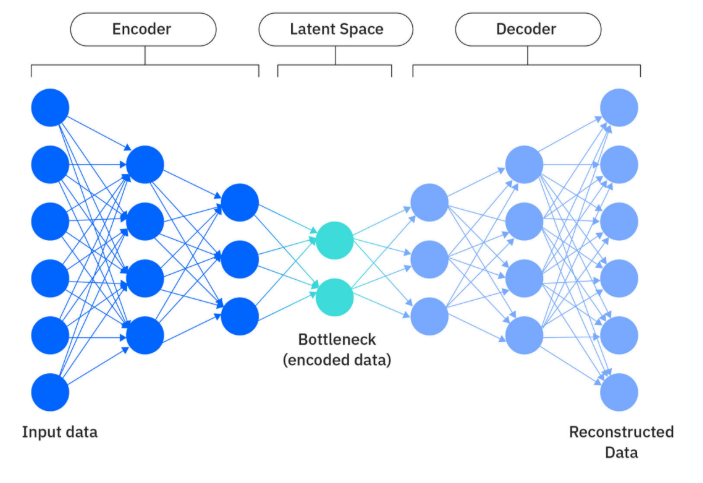
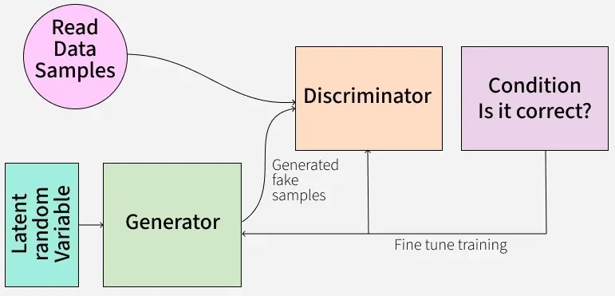
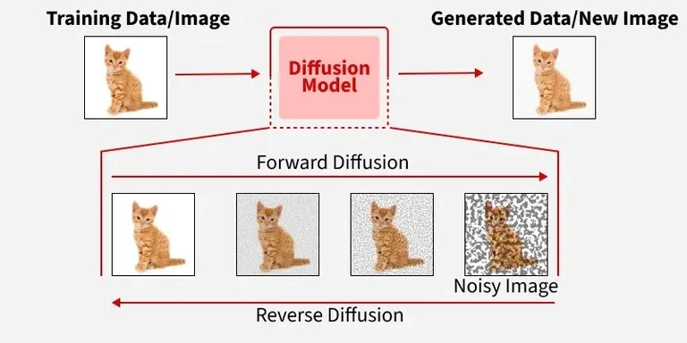
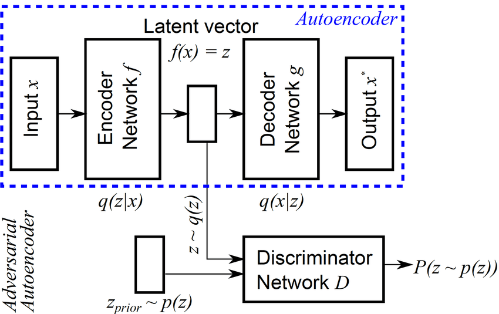
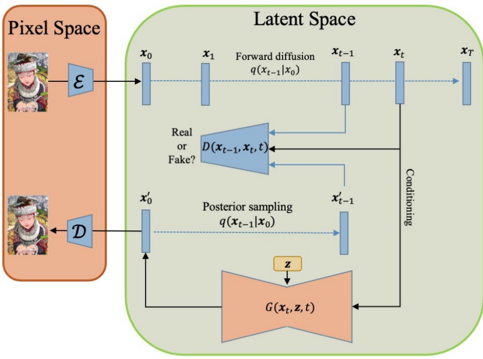
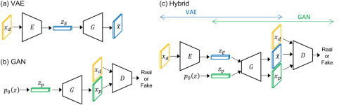

# Models 
> The `models` module implements several families of deep generative models, ranging from probabilistic latent-variable models to adversarial learning and score-based diffusion methods.

Generative models aim to learn the underlying probability distribution $p(x)$ of a dataset so that new, realistic samples can be generated. Although Variational Autoencoders (VAEs), Generative Adversarial Networks (GANs), and Diffusion Models all pursue this objective, they rely on fundamentally different learning principles.

| Family | Implementation | Learning Principle | Strengths | Weaknesses |
|--------| -------------- | -------------------|-----------|------------|
| **Variational Autoencoders (VAEs)** | MLP-VAE, CNN-VAE, VQ-VAE | Variational inference | Stable training, structured latent space | Slightly blurry samples |
| **Generative Adversarial Networks (GANs)** | MLP-GAN, DCGAN, Unrolled GAN, CGAN, WGAN, StyleGAN | Adversarial game | Sharp, realistic images | Difficult optimization, mode collapse |
| **Diffusion Models** | CNN, Residual U-Net, Latent Diffusion, DDPM, DDIM | Iterative denoising | Excellent diversity and quality | Slow sampling |
| **Hybrid Models (notebook only)** | Adversarial Autoencoders (AAEs), Diffusion-GAN, VAE-GAN | Combination of paradigms | Leverage strengths of multiple approaches | Increased complexity |

The goal of this module is to provide clean PyTorch implementations of these architectures while exposing a unified training interface and highly configurable building blocks.




# Directory Structure
```text
models/
├── GANs.py         
├── VAEs.py        
├── diffusion_models.py    
```

# Variational Autoencoders (VAEs)



## Theory (quick)
A Variational Autoencoder is a probabilistic latent-variable model that learns a compressed representation of the data while simultaneously learning how to reconstruct it.

Instead of directly encoding an input into a deterministic latent vector, the encoder predicts the parameters of a probability distribution

$$
q_\phi(z|x)=\mathcal N(\mu,\sigma^2)
$$

from which a latent vector is sampled using the **reparameterization trick**

$$
z=\mu+\sigma\odot\epsilon, \qquad \epsilon\sim\mathcal N(0,I)
$$

The decoder then learns the conditional distribution

$$
p_\theta(x|z)
$$

allowing new samples to be generated simply by sampling

$$
z\sim\mathcal N(0,I)
$$

Training maximizes the **Evidence Lower Bound (ELBO)**

$$
\mathcal L = \underbrace{\mathcal L_{recon}}_{\text{reconstruction}} + \beta \underbrace{D_{KL}(q(z|x) \| p(z))}_{\text{latent regularization}}
$$

The reconstruction term ensures faithful reconstructions, while the KL divergence regularizes the latent space toward a Gaussian prior, enabling smooth interpolation and generation.

## Implemented Variants
This repository provides several VAE architectures.

| Model | Description |
|--------|-------------|
| **MLP-VAE** | Fully-connected encoder/decoder (`MLPEncoder` and `MLPDecoder`) suitable for vector data and toy datasets |
| **CNN-VAE** | Convolutional encoder/decoder for images (`CNNEncoder` and `CNNDecoder`) |
| **FastCNNVAE** | Lightweight CNN implementation with internally-defined architecture for faster training |
| **VQ-VAE** | Discrete latent representation using vector quantization |

Those models can are defined in the following classes:
```py
class BaseVAE():
    __init__() 
    forward()
    compute_loss()
    train_step()
    fit()
    reconstruct()
    sample()
    # + helpers to save/load and plot 
```
and 
```py
class FastCNNVAE():
    # same interface as BaseVAE but with a fixed architecture for the encoder and decoder
```

## Vector Quantization (VQ-VAE)
Unlike standard VAEs that learn a continuous latent space, **VQ-VAEs** learn a discrete latent representation.

Instead of sampling a Gaussian latent vector, encoder outputs are replaced by the closest vector inside a learnable codebook

$$
z_q = \arg\min_{e_i}\|z_e-e_i\|^2
$$

Training optimizes three objectives simultaneously:
- **Reconstruction loss**
- **Codebook loss**, which updates the embedding vectors
- **Commitment loss**, encouraging encoder outputs to remain close to their assigned embeddings

This discrete representation often produces sharper reconstructions and is widely used in modern autoregressive and latent diffusion models.

## Configuration 
Centralized configuration dataclass defining the architecture and hyperparameters of the VAE, 
to tune the shape of the encoder and decoder, the latent space, and the training procedure.
```py
@dataclass
class VAEConfig:
    model_type: Literal["vae", "vqvae", "fastvae"] = "vae"
    architecture: Literal["mlp", "cnn"] = "mlp"
    reconstruction_loss: Literal["mse", "bce"] = "bce"

    input_dim: int = 784    
    hidden_dims: Tuple[int, ...] = (128, 64)
    latent_dim: int = 32         

    # for CNN
    image_channels: int = 1           
    image_size: int = 28
    kernel_size: int = 4
    stride: int = 2
    padding: int = 1

    # VQ-VAE specific
    num_embeddings: int = 256
    embedding_dim: int = 64
    beta_vq: float = 0.25

    # Regularization
    dropout: float = 0.0
    use_batchnorm: bool = False

    # Training
    beta_kl: float = 1.0
    gamma: float = 0.5
    learning_rate: float = 1e-3
    step_size: int = 20
    weight_decay: float = 1e-5
```

## Metrics
Tracks training and evaluation statistics.
```py
@dataclass
class VAEMetrics:
    loss: float = 0.0
    recon: float = 0.0
    kld: float = 0.0
    vq: float = 0.0
```

| Metric | Description |
| ------ | ----------- |
| loss | Total optimization objective |
| recon | Reconstruction error |
| kld | KL divergence loss |
| vq | Vecotr quantization loss |


# Generative Adversarial Networks (GANs)



## Theory (quick)
GANs formulate generation as a two-player minimax game between
- a **Generator** \(G\), producing synthetic samples
- a **Discriminator** \(D\), distinguishing real from generated data

During training:
1. the generator maps random noise $z\sim\mathcal N(0,I)$ into synthetic samples $x_{fake}=G(z)$
2. the discriminator predicts whether an image comes from the real dataset or from the generator
3. both networks improve simultaneously through adversarial optimization.

The original objective is

$$
\min_G\max_D \mathbb E[\log D(x)] + \mathbb E[\log(1-D(G(z)))]
$$

Eventually, the generator learns to approximate the true data distribution so well that generated samples become indistinguishable from real data by the discriminator.

## Implemented Architectures

| Model | Description |
|--------|-------------|
| **MLP-GAN** | Basic adversarial model for low-dimensional data (`MLPGenerator` and `MLPDiscriminator`) |
| **DCGAN** | Deep convolutional GAN for image synthesis (`DCGANGenerator` and `DCGANDiscriminator`) |
| **Conditional GAN (CGAN)** | Conditions generation on class labels (`CGANGenerator` and `CGANDiscriminator`) |
| **Unrolled GAN** | Stabilizes training by unrolling discriminator optimization (unrolling = simulating several discriminator updates before updating the generator) |
| **WGAN / WGAN-GP** | Wasserstein distance objective for improved convergence + gradient penalty regularization and cliping |
| **StyleGAN** | Style-based generator with adaptive feature modulation |

Those models can are defined in the following class:
```py
class GAN():
    __init__()
    gradient_penalty()
    discriminator_loss()
    generator_loss()
    train_step()
    fit()
    sample()
    # + helpers to save/load
```

## StyleGAN
StyleGAN departs from classical GAN generators by separating **high-level semantic control** from stochastic image synthesis.

Instead of directly feeding the latent vector into the generator, the latent code first passes through a **mapping network** (`MappingNetwork`) which transforms the latent distribution into an intermediate latent space : $z \rightarrow w$ 

The generator then progressively synthesizes images using:
- **Styled Convolution Blocks** (`StyledConvBlock` class): whose activations are modulated by the style vector
- **AdaIN (Adaptive Instance Normalization)** (`AdaIN` class): injecting style information at every resolution
- **Per-layer stochastic noise**: (inside the `StyledConvBlock`): producing fine-scale details such as hair strands or textures.

This architecture (`StyleGANGenerator` and `StyleGANDiscriminator`) greatly improves latent disentanglement and image quality compared to traditional GANs but requires careful tuning of the generator and discriminator architectures, as well as the training procedure while costly increasing the number of parameters and training time.

### Configuration
Centralized configuration dataclass defining the architecture and hyperparameters of the GAN, including the generator and discriminator architectures and training procedure.
```py
@dataclass
class GANConfig:
    architecture: Literal["GAN", "CGAN", "DCGAN", "MLP_UnrolledGAN", "DC_UnrolledGAN", "StyleGAN"] = "GAN"
    loss: Literal["Default", "Wasserstein", "LeastSquare"] = "Default"
    latent_dim: int = 32   

    # For MLPs
    input_dim: int = 784    
    hidden_dims: Tuple[int, ...] = (128, 64) # to put at "conv_channels" for DCGANs and "style_channels" for StyleGANs

    # For DCGANs
    image_size: int = 28
    image_channels: int = 1 # also for StyleGANs
    kernel_size: int = 4 # also for StyleGANs discriminator
    stride: int = 2 # also for StyleGANs discriminator
    padding: int = 1 # also for StyleGANs discriminator
    noise_coef: float = 0.03 # also for StyleGANs

    # For CGANs
    num_classes: int = 10

    # For Unrolled GANs
    unrolled_steps: int = 5 

    # For WGANs
    weight_clip: float = 0.01
    gradient_penalty_lambda: float = 10.0
    n_critic: int = 5

    # For LSGANs
    lsgan_lambda: float = 0.5

    # For StyleGANs
    style_dim: int = 64
    # also use latent_dim for the mapping network input
    # and image_channels for the final output channels of the generator and input channels of the discriminator
    kernel_size_style_gen: int = 3
    stride_style_gen: int = 1
    padding_style_gen: int = 1
    noise_weight: float = 0.05
    mixing_prob: float = 0.9

    # Regularization
    dropout: Optional[float] = None
    batch_norm: Optional[bool] = False
    spectral_norm_on: Optional[bool] = False

    # Training 
    learning_rate: float = 1e-3
    step_size: int = 20
    weight_decay: float = 1e-5
    beta1: float = 0.5
    beta2: float = 0.999

    # EMA Sampling
    is_ema: bool = False
    ema_decay: float = 0.999
```

### Metrics
Tracks training and evaluation statistics, used to monitor the dynamics of the adversarial game between the generator and discriminator. Ideally, the generator loss should decrease while the discriminator loss should stabilize around 0.5 (indicating that the discriminator cannot distinguish real from fake samples).
```py
@dataclass
class GANMetrics:
    G_loss: float = 0.0
    D_loss: float = 0.0
```


# Diffusion Models



## Theory (quick)
Diffusion models generate data by learning to reverse a gradual noising process. 
Training consists of two complementary processes.

### Forward diffusion

Noise is progressively added to an image over $T$ timesteps until the final sample becomes nearly pure Gaussian noise

$$
x_0 \rightarrow x_1 \rightarrow \cdots \rightarrow x_T
$$

The forward transition is

$$
q(x_t|x_{t-1}) = \mathcal N(\sqrt{1-\beta_t}x_{t-1},\beta_tI)
$$

### Reverse diffusion
A neural network learns to predict the injected noise

$$
\epsilon_\theta(x_t,t)
$$

allowing the reverse process to gradually remove noise and reconstruct realistic images.

Sampling therefore starts from $x_T\sim\mathcal N(0,I)$ and repeatedly denoises until $x_0$ is obtained.

Unlike GANs, diffusion models optimize a simple regression objective and are remarkably stable to train.

## Noise Scheduler
The noise scheduler defines the noise schedule for the diffusion process, including the number of timesteps and the beta schedule (linear or cosine). It computes the alpha and alpha_bar values used in the forward diffusion process and provides methods for sampling from the forward and reverse processes.
```py
class NoiseScheduler():
    __init__() # compute the beta schedule, alpha, and alpha_bar values based on the configuration
    cosine_schedule()
    q_sample()
```

## Time Embedding
The time embedding module generates sinusoidal embeddings for the timesteps, which are used as input to the neural network model (U-Net or CNN) to condition the noise prediction on the current timestep.
```py
class TimeEmbedding():
    __init__() # compute the sinusoidal embeddings for the timesteps based on the configuration
    forward() # return the time embedding for a given timestep
```

## Neural Network Model
The neural network model (U-Net or CNN) predicts the noise added to the data at each timestep. It takes the noisy input, the timestep, and optionally class labels (for conditional generation)
| Model | Use Case |
| ----- | -------- |
| `CNN` | Simple convolutional architecture for small images |
| `ResUnet` | Residual U-Net architecture for larger images and more complex datasets | 

ResUnet uses Up/Downsampling blocks, residual connections, and attention mechanisms to capture multi-scale features and improve the quality of generated samples (each has then own class : `ResBlock`, `AttentionBlock`, `UpBlock`, `DownBlock`

## Latent Autoencoder (Optional)
The latent autoencoder is used for latent diffusion, where the diffusion process operates in a lower-dimensional latent space. It consists of an encoder that maps the input data to a latent representation and a decoder that reconstructs the data from the latent representation.
```py
class LatentAutoEncoder():
    __init__()
    encode()
    decode()
```
For the parametrization of the Unet when using latent diffusion, the image channels and size are set to the latent dimensions instead of the original image dimensions, since there has been this reduction stuff:
```py
image_channels=self.latent_c if self.cfg.use_latent_diffusion else cfg.image_channels,
image_size=self.latent_h if self.cfg.use_latent_diffusion else cfg.image_size,
```

## Exponential Moving Average (EMA) (Optional)
The EMA maintains a moving average of the model parameters during training, which can improve the stability and performance of the model during sampling. The EMA parameters are updated after each training step and can be used for generating samples during evaluation or inference.

## Model
The full diffusion model class combines the noise scheduler, time embedding, neural network model, and optional latent autoencoder and EMA into a single interface for training and sampling.
```py
class DiffusionModel():
    __init__()
    forward_diffusion()
    diffusion_loss()
    train_step()
    fit()
    sample() # reverse diffusion process
    # + helpers to save/load
```

## Configuration
Centralized configuration dataclass defining the architecture and hyperparameters of the diffusion model, including the neural network architecture, noise schedule, training procedure, and sampling method.
```py
@dataclass
class DiffusionConfig:
    # ======================
    # Model
    # ======================
    model_type: Literal["cnn", "res_unet"] = "res_unet"
    loss: Literal["mse", "l1"] = "mse"

    num_classes: Optional[int] = None # Act as a boolean flag for conditional generation (if None, unconditional)
    cond_drop_prob: float = 0.1
    guidance_scale: float = 0.9

    image_size: int = 32
    image_channels: int = 3

    base_channels: int = 64
    channel_mults: Tuple[int, ...] = (1, 2, 4)

    time_emb_dim: int = 128
    time_width_coef: int = 4

    # ======================
    # Convolutional tuning
    # ======================
    use_attention: bool = True
    attention_resolutions: Tuple[int, ...] = (8,)  # to apply attention to ResUnet : should be among the image_size / 2**i
    num_heads: int = 4

    dropout: float = 0.0
    kernel_size: int = 3
    stride: int = 1
    padding: int = 1
    use_batch_norm: bool = False # for classic CNNs
    num_groups: int = 8
    eps_groupnorm: float = 1e-5

    down_kernel_size: int = 4
    down_stride: int = 2
    down_padding: int = 1
    down_num_res_blocks: int = 1
    up_kernel_size: int = 4
    up_stride: int = 2
    up_padding: int = 1
    up_num_res_blocks: int = 1

    # ======================
    # Diffusion
    # ======================
    timesteps: int = 1000
    beta_schedule: Literal["linear", "cosine"] = "linear"

    beta_start: float = 1e-4
    beta_end: float = 0.02
    s: float = 0.008 # small offset for cosine schedule

    # ======================
    # Training
    # ======================
    learning_rate: float = 2e-4
    beta1: float = 0.5
    beta2: float = 0.999
    weight_decay: float = 0.0
    batch_size: int = 128
    use_torch_compile: bool = False
    compile_mode: Literal["default", "reduce-overhead", "max-autotune"] = "reduce-overhead"

    # ======================
    # Sampling
    # ======================
    use_ddim: bool = False
    ddim_steps: int = 50
    use_ema: bool = False
    ema_decay: float = 0.9999

    # ======================
    # Latent Diffusion
    # ======================
    use_latent_diffusion: bool = False
    latent_dim: int = 16
    latent_hidden_dim: int = 64
    latent_kernel_size: int = 4
    latent_stride: int = 2
    latent_padding: int = 1
    latent_scale_factor: float = 0.18215
```


# Hybrid Models (notebook only)
The hybrids models are only available in the notebook for demonstration purposes. They combine the strengths of different generative paradigms:
* **AAEs (Adversarial Autoencoders)** are a hybrid of VAEs and GANs, combining the latent representation learning of VAEs with the adversarial training of GANs. They can be implemented by adding a discriminator to the latent space of a VAE, encouraging the latent distribution to match a desired prior distribution.



* **Diffusion-GANs** combine the iterative refinement of diffusion models with the adversarial training of GANs, potentially improving sample quality and diversity. They can be implemented by using a diffusion model as the generator in a GAN framework, where the discriminator evaluates the quality of the generated samples.



* **VAE-GAN** combine the latent representation learning of VAEs with the high-fidelity sample generation of GANs. They can be implemented by using a VAE as the generator in a GAN framework, where the discriminator evaluates the quality of the reconstructed samples.


